<a id="mulu">目录</a>
<a href="#mulu" class="back">回到目录</a>
<style>
    .back{width:40px;height:40px;display:inline-block;line-height:20px;font-size:20px;background-color:lightyellow;position: fixed;bottom:50px;right:50px;z-index:999;border:2px solid pink;opacity:0.3;transition:all 0.3s;color:green;}
    .back:hover{color:red;opacity:1}
    img{vertical-align:bottom;}
</style>

<!-- @import "[TOC]" {cmd="toc" depthFrom=3 depthTo=6 orderedList=false} -->

<!-- code_chunk_output -->

- [线性表](#线性表)
    - [定义](#定义)
    - [线性表的顺序存储实现](#线性表的顺序存储实现)
    - [线性表的链式存储实现](#线性表的链式存储实现)
    - [广义表和多重链表](#广义表和多重链表)
- [堆栈](#堆栈)
    - [存储方式](#存储方式)
    - [应用：递归--汉诺塔](#应用递归-汉诺塔)
    - [应用：后缀表达式求值](#应用后缀表达式求值)
- [队列](#队列)
    - [存储](#存储)
- [串](#串)
    - [基础概念](#基础概念)
    - [存储方式](#存储方式-1)
      - [定长顺序存储](#定长顺序存储)
      - [堆分配存储](#堆分配存储)
      - [链式存储](#链式存储)
- [数组与矩阵](#数组与矩阵)
    - [矩阵元素地址](#矩阵元素地址)
    - [稀疏矩阵的压缩存储](#稀疏矩阵的压缩存储)
      - [线性表](#线性表-1)
      - [十字链表](#十字链表)
      - [三元组矩阵](#三元组矩阵)
      - [带辅助向量的三元组](#带辅助向量的三元组)
    - [矩阵的转置](#矩阵的转置)
      - [压缩转置](#压缩转置)
      - [快速转置](#快速转置)
- [应用](#应用)
    - [找子串](#找子串)
      - [BF算法](#bf算法)
      - [KMP算法](#kmp算法)
      - [手算next数组](#手算next数组)
    - [一元多项式的加法与乘法运算](#一元多项式的加法与乘法运算)
    - [两个有序链表合并](#两个有序链表合并)
    - [颠倒链表](#颠倒链表)
      - [录入数据及有效数据统计](#录入数据及有效数据统计)
      - [头插法反转链表](#头插法反转链表)
    - [出栈的可能顺序](#出栈的可能顺序)

<!-- /code_chunk_output -->

<!-- 打开侧边预览：f1->Markdown Preview Enhanced: open...
只有打开侧边预览时保存才自动更新目录 -->

### 线性表
如何表示多项式f(x)=a~0~+a~1~x+...+a~n-1~x^n-1^+a~n~x^n^
多项式的关键数据：多项式项数n、各项系数a~i~
1. 顺序存储结构直接表示：数组各分量对应多项式各项，a[i]为各项系数
例如：f(x)=4x^5^-3x^2^+1可表示成

两个多项式相加就是两个数组对应分量相加。
问题在于：当表示如f(x)=x+3x^2000^这种多项式时内存浪费
2. 顺序存储结构表示非零项：每个非零项包含系数a~i~和指数i两个信息，可以将多项式看出一个(a~i~,i)二元组的集合
例如：P~1~(x)=9x^12^+15x^8^+3x^2^和P~2~(x)=26x^19^-4x^8^-13x^6^+82可表示成

即按指数大小有序存储
相加过程：从头开始，比较两个多项式当前对应项的指数，若相同，将系数相加；不相同就保留
3. 链表结构存储非零项：链表中每个结点存储多项式中的一个非零项，包括系数和指数两个数据域以及一个指针域。
例如：P~1~(x)=9x^12^+15x^8^+3x^2^和P~2~(x)=26x^19^-4x^8^-13x^6^+82可表示成：


总结：
- 同一个问题可以有不同的表示（存储）方法；
- 有一类共性问题：有序线性序列的组织和管理。
##### 定义
一个线性表是n个具有**相同特性**的数据元素的**有限**序列。
线性表中数据元素之间的关系是一对一的关系，即除了第一个和最后一个数据元素之外，其它数据元素都是**首尾相接**的（只适用大部分线性表，而不是全部。如循环链表的尾指针指向了首位结点）
表中元素个数称为**线性表的长度**；线性表没有元素时，称为**空表**； 表起始位置称为**表头**，表结束位置称**表尾**。
##### 线性表的顺序存储实现
利用数组的连续存储空间存放线性表的各元素。线性表的顺序存储中的下标从0开始。

```
struct LNode{
    ElementType Data[MAXSIZE]; //用于储存数据的数组
    int Last; //数组的最大索引，即该表的长度为last+1
};
```
##### 线性表的链式存储实现
不要求逻辑上相邻的两个元素物理上也相邻，通过“链”建立起数据元素之间的逻辑关系。插入、删除不需要移动数据元素，只需要修改“链”。
```
struct LNode{
    ElementType Data;  //节点对应的数据
    List Next;  //下一个节点的位置
};
```
这种方式和链表几乎相同，都是分成数据域和指针域
***
[两种存储方式实现](./附录2：线性表的两种存储方式.md)
***
##### 广义表和多重链表
广义表是线性表的推广。对于线性表而言，n个元素都是基本的单元素；广义表中，这些元素不仅可以是单元素也可以是另一个广义表。
多重链表：链表中的节点可能同时隶属于多个链。即多重链表中结点的指针域会有多个；但包含两个指针域的链表并不一定是多重链表，比如双向链表不是多重链表。
多重链表有广泛的用途：基本上如树、图这样相对复杂的数据结构都可以采用多重链表方式实现存储。
### 堆栈
**栈**(stack)又名**堆栈**，它是一种运算受限的线性表，限定仅在表尾进行插入和删除操作的线性表。
这一端被称为**栈顶**，相对地，把另一端称为**栈底**。向一个栈插入新元素又称作**进栈**、**入栈**或**压栈**，它是把新元素放到栈顶元素的上面，使之成为新的栈顶元素；
从一个栈删除元素又称作**出栈**或**退栈**，它是把栈顶元素删除掉，使其相邻的元素成为新的栈顶元素。
因为栈只在栈顶进行数据操作，所以它是**先进后出、后进先出**的
{:width=300px height=300px}
##### 存储方式
1. 顺序存储：由一个一维数组和一个记录栈顶元素位置的变量组成。
	```
	struct SNode{
		ElementType Data[MaxSize]; //栈数据存储
		int Top; //栈顶元素的索引
	}
	Data[++Top]=new_val; //压入元素
	printf("%d",Data[Top--]); //弹出元素
	```
	例：用一个数组实现两个堆栈，要求最大地利用数组空间
	--使这两个栈分别从数组的两头开始向中间生长，当两个栈的栈顶指针相遇时，表示两个栈都满了。
2. 链式存储：实际上就是一个单链表，叫做链栈。插入和删除操作只能在链栈的栈顶进行（链表的尾端）；当然也可以把首元结点作栈顶，之后用头插法进行插入/删除
##### 应用：递归--汉诺塔
汉诺塔问题：现有三个柱子A、B、C，其中有N个圆盘安从小到大的顺序在A柱上，要求将圆盘按从小到大的顺序借助B柱移动到C柱中。
当`N=1`时：
{:width=200px height=200px}
当`N=1`时，我们只须将A中圆盘直接移动到C盘上即可`(A-->C)`
***
N=2时：可以先将最上面的圆盘先移到B中，再将底部圆盘移到C中，最后将B柱中的圆盘移到C中
{:width=200px height=200px}将顶部圆盘移到B柱中
↓
{:width=200px height=200px}将底部圆盘移到C柱中 
↓
{:width=200px height=200px}将B中圆盘移动到C柱中，完成整个汉诺塔过程。
实际上这三步分别做了：将**顶部圆盘**借助B柱移动到C柱，**底部圆盘**直接从A柱移动到C柱。
***
当N>=3时，可以运用整体思想，将底部圆盘看作一个个体，将除底部圆盘的之外的圆盘看作第二个圆盘：
{:width=300px height=300px}
1. 令底部圆盘为第N个圆盘，其余圆盘为N-1个
2. 先把这N-1个借助C从A移动到B上（因为有多个，不能像N=2时直接把一个圆盘移到B上）
3. 再移动底部圆盘（A->C）
4. 把N-1个圆盘借助A柱从B移动到C柱（同样是因为有多个，不能直接B->C
5. 再对这N-1个圆盘进行同样的拆分
```
void move(char A, char C, int n)
{
    printf("把第%d个圆盘从%c--->%c\n", n, A, C);
}
void HanoiTower(char A, char B, char C, int n) //把n个圆盘借助B从A移到C上
{
    if (n == 1)
    {
    	move(A, C, n);
    }
    else
    {
	HanoiTower(A, C, B, n - 1); //将n-1个圆盘从A柱借助于C柱移动到B柱上
	move(A, C, n); //将A柱子最后一个圆盘移动到C柱上
	HanoiTower(B, A, C, n - 1); //将n-1个圆盘从B柱借助于A柱移动到C柱上
    }
}
int main()
{
    int n = 100; //要移动的圆盘个数
    HanoiTower('A', 'B', 'C', n); //将n个圆盘从A柱借助于B柱移动到C柱上
    return 0;
}
```
##### 应用：后缀表达式求值
后缀表达式：运算符号位于两个运算数之后，如`62/3-42*+` 
计算方法：先读取两个数`6` `2`，碰到了`/`，就是`6/2`，变成`33-42*+`；
再读取两个数`3` `3`，碰到了`-`，就是`3-3`，变成`042*+`；
对于有3个数的情况，先读取`*`号，前面的两个数为`4` `2`，就是`4*2`，变成`08+`，即`0+8=8`
从此可以总结出后缀表达式求值的规律：
1. 运算数：入栈
2. 运算符：从栈中弹出适当数量的运算数，计算结果入栈
3. 最后栈顶上的元素就是表达式的结果值
### 队列
队列(queue)是一种特殊的线性表，特殊之处在于它只允许在表的前端(front)进行删除操作（出队列），而在表的后端(rear)进行插入操作（进队列）。和栈一样，队列是一种操作受限制的线性表。
进行插入操作的端称为队尾，进行删除操作的端称为队头。
因此队列是**先进先出、后进后出**的
##### 存储
1. 顺序存储：由一个一维数组和一个记录队列头元素位置的变量`front`以及一个记录队列尾元素位置的变量`rear`组成。
```
struct QNode {
    ElementType Data[ MaxSize ];
    int rear;
    int front;
}
```
最开始这两个变量都为0，加入一个元素时rear加1（元素被加到新rear的位置上），删除一个元素时front加1（原front位置上的元素被删除）。
这样可能导致rear已经到数组最大值了，加不进去，但是数组前面还是空的。
2. 顺环队列：把这个数组头尾相接，形成一个环，最开始的时候front=rear，假设一共有6个位置，则front与rear的差值也是从0-5（共6种情况），而队列中含有元素的数量是0-6（共7种情况）所以不能用它们的差值判断队列是空的还是满的（当没有元素或有6个元素时front都=rear）。
解决办法：使用一个额外的size记录元素数量，或者仅使用5个数组空间进行存储（此时除了队列为空，front都不可能=rear）
3. 链式存储：用一个单链表实现。插入和删除操作分别在链表的两头进行（链表头删除，尾插入）
```
struct Node{ //队列节点
    ElementType Data;
    struct Node *Next;
}
struct QNode{  //链队列结构
    struct Node *rear;  //指向队尾结点
    struct Node *front;  //指向队头结点
}
```
### 串
##### 基础概念
**串**即字符串，是由零个或多个字符组成的有限序列，是数据元素为**单个字符**的特殊线性表。
**串长**：串中字符的个数(n≥0)。n=0 时称为空串。
**空串**(Null String)是指长度为零的串；
**空格串**(Blank String),是指包含一个或多个空格字符'` `'(空格键)的字符串.
**子串**：串S中任意个连续的字符序列叫S的子串，此时S叫主串。
**子串位置**：子串的第一个字符在主串中的序号。
**字符位置**：字符在串中的序号。
**串相等**：串长度相等,且对应位置上字符相等。
注：空串是任意串的子串；任意串S都是S本身的子串，除S本身外，S的其他子串称为S的真子串
##### 存储方式
###### 定长顺序存储
特点：用一组连续的存储单元来存放串，直接使用定长的字符数组来定义，数组的上界预先给出，故称为静态存储分配。
```
#define Maxstrlen 255    //用户可用的最大串长
typedef unsigned char SString[Maxstrlen+1] SString;   
SString s; //s 是一个可容纳255个字符的顺序串
```
说明：
- 一般用`SString[0]`来存放串长信息
- C语言约定在串尾加结束符`'\0'`，以利操作加速，但不计入串长（用首址和串长、或首址和尾标记来描述串数组）
- 若字符串超过`Maxstrlen`则自动截断（因为静态数组不够长存不进去）
***
字符串截取
```
//将S从pos开始截取len长度的字符串，存入sub中
Status SubString(SString &sub, SString S, int pos, int len)
{  
	if(pos < 1 || pos > S[0] || len < 0 || len > S[0] - pos + 1) return ERROR; 
	//若pos和len参数越界，则告警
 	Sub[1……len]=S[pos……pos+len-1]; //使用for循环
 	Sub[0]=len;   
	return OK;
}
```
###### 堆分配存储
还是用一组连续的存储单元来存放串，但存储空间是在程序执行过程中动态分配而得
```
Typedef struct {
	char *ch; //储存字符串信息：若非空串，按串长分配空间，否则ch=NULL
	int length; //串长度
}HString
```
利用`malloc`函数合理预设串长空间，若在操作中串值改变，还可以利用`realloc`函数按新串长度增加空间（动态数组）
***
建堆函数
```
//生成一个串T, T值←串常量chars
Status StrAssign(HString &T, char *chars)
{  
    if (T.ch) free(T.ch); //释放T原有空间
    for (i=0, c=chars;(*c)!='\0';++i, ++c); //求chars的串长度i
    if (!i) //如果chars为空串
    {
	T.ch = NULL; 
	T.length = 0;
    } //就把T也设为空串
    else
    {
	if (!(T.ch = (char*)malloc(i*sizeof(char)))) //给T.ch分配内存（内存大小同chars串）
	    exit(OVERFLOW); //若分配失败则退出
	T.ch[0..i-1] = chars[0..i-1]; //for循环把T.ch进行赋值
	T.length = i; //更改T的长度
    }
    return OK;
}
```
***
串插入函数
```
//在串S的第pos个字符之前插入串T
Status StrInsert (HString &S, int pos, HString T)
{    
	if (pos < 1 || pos > S.length + 1)  return ERROR; //pos不合法则告警
	if(T.length) //只要串T不空，就需要重新分配S空间，以便插入T
	{               
 	    if (!(S.ch=(char*)realloc(S.ch, (S.length+T.length)*sizeof(char)))) //开辟新空间，大小为两个串长度和
		    exit(OVERFLOW);   //若开不了新空间，则退出
	    for (i=S.length-1; i>=pos-1; --i) 
		S.ch[i+T.length] = S.ch[i]; //为插入T而腾出pos之后的位置，即从S的pos位置起全部字符均后移T.length
	    S.ch[pos-1..pos+T.length-2] = T.ch[0..T.length-1]; //循环插入T   
	    S.length + = T.length; //刷新S串长度
	}  
    return OK;
} 
```
###### 链式存储 
用链表存储串值，易插入和删除
- 链表结点的数据分量长度取1（个字符）
- 链表结点（数据域）大小取n（例如n=4）

使用较少
### 数组与矩阵
##### 矩阵元素地址
规定行优先或列优先，只要知道以下三要素便可随时求出任一元素的地址：
- 开始结点的存放地址（即基地址）
- 维数和每维的上、下界；
- 每个数组元素所占用的单元数

行优先指先存行再存列
```
1 2 3
4 5 6
```
计算二维数组`A[c1..d1,c2..d2]`元素地址的通式：
行优先存储时的地址公式为LOC(a~ij~)=LOC(a~c1,c2~)+[(i-c1)\*(d2-c2+1)+(j-c2)]\*L
其中LOC(a~c1,c2~)为数组基址，(i-c1)为a~ij~之前的行数，(d2-c2+1)为总列数，(j-c2)为a~ij~所在行前面的元素的个数，L为元素长度
列优先存储的通式为：LOC(a~ij~)=LOC(a~c1,c2~)+[(j-c2)\*(d1-c1+1)+(i-c1)]\*L
***
低维优先的地址计算公式（n维数组的映像函数）：
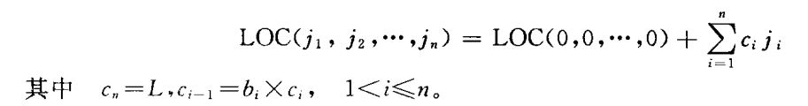{:width=100 height=70}
b~i~为第i维的长度，数组中的每个元素都对应下标(j~1~,j~2~,...,j~n~)，其中0≤j~i~≤b~i~-1
##### 稀疏矩阵的压缩存储
**稀疏矩阵**：矩阵中非零元素的个数较少（一般小于5%）。
**压缩存储**：若多个数据元素的值都相同，则只分配一个元素值的存储空间，且零元素不占存储空间。只要一些特殊矩阵，如：对称矩阵、对角矩阵、三角矩阵、稀疏矩阵等才需要压缩存储。
思路：**只存储稀疏矩阵中的非零元素**，对每个非零元素增开若干存储单元，用来存放其所在的行号和列号，便可准确反映该元素所在位置。
实现方法：每个稀疏矩阵可用一个**三元组表**来表示，其中每个非零元素都用一个**三元组**(i，j，a~ij~)来表示，i、j和a~ij~分别代表该元素的**行下标**、**列下标**和**元素值**。
***
对如图所示的稀疏矩阵，有4种表示方法
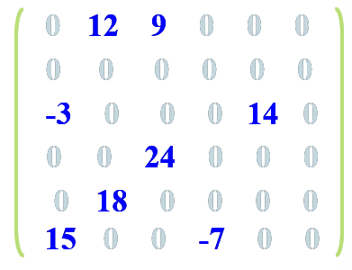{:width=150 height=150}
###### 线性表
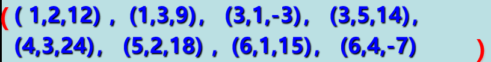{:width=50 height=50}
###### 十字链表
方便稀疏矩阵的加减运算，每个非0元素节点占用**5**个域
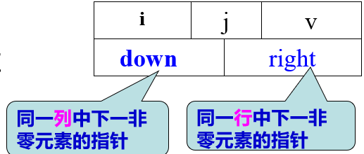{:width=100 height=100}
例：
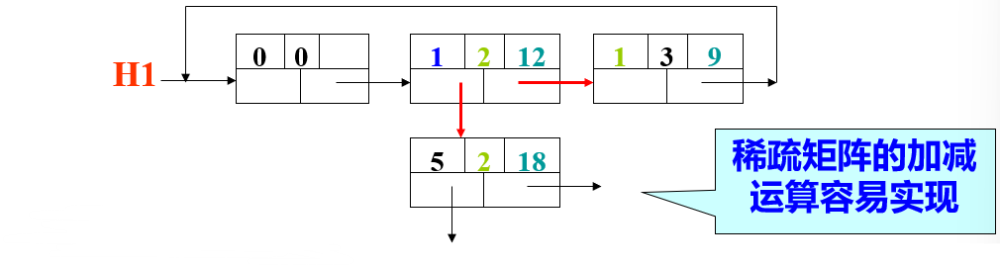{:width=100 height=100}
特点：
- 每行非零元素链接成带表头结点的循环链表
- 每列非零元素也链接成带表头结点的循环链表
- 每个非零元素既是行循环链表中的一个结点；又是列循环链表中的一个结点，即呈**十字链状**

不常用
###### 三元组矩阵
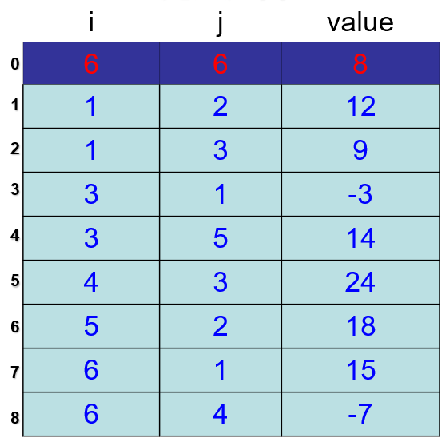{:width=200 height=200}
表示第i行第j列为非0元素，值为value。
为更可靠描述，通常再加一行“总体”信息（第一行）：即总行数、总列数、非零元素总个数，如果不加就无法得到唯一的三元组（可能有全为0的行/列）
缺点：失去随机存取功能（必须遍历三元组矩阵才能确定指定位置的值）
###### 带辅助向量的三元组
便于高效访问稀疏矩阵中任一非零元素，方法是**增加2个辅助向量**：
- 记录每行非0元素个数，用`NUM(i)`表示
- 记录稀疏矩阵中每行第一个非0元素在三元组中的行号，用`POS(i)`表示。

注意这个方法基于[三元组矩阵](#三元组矩阵)的，还需创建三元组矩阵：
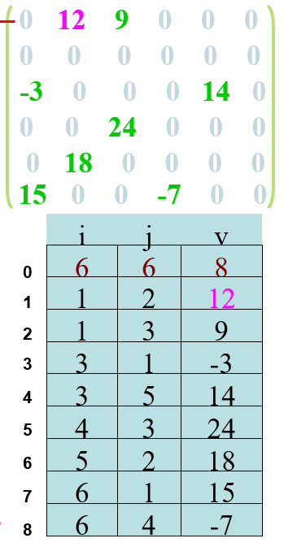{:width=300 height=300}
该方法特有的2个辅助向量：
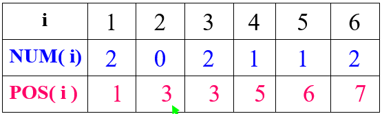{:width=100 height=100}
其中`POS(1)`=`1`，`POS(i)`=`POS(i-1)`+`NUM(i-1)`
即`本行第一个非0元素位置`=`上一行第一个非0元素位置`+`上一行非0元素数量`
##### 矩阵的转置
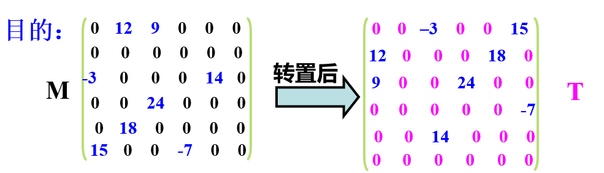{:width=100 height=100}
若采用三元组存储稀疏矩阵，只把每个元素的行下标和列下标（三元组的i和j）互换，是不能完成转置操作的。还需要：
- 互换总行数和总列数
- 重排三元组矩阵内元素的顺序，使其能有规律的排列
###### 压缩转置
扫描三元组表的列序(j)，按j=1~n的顺序选出三元组，交换它的i和j，并存入新三元组表中，结果表是按行(原来的j、新的i)值从小到大排序的
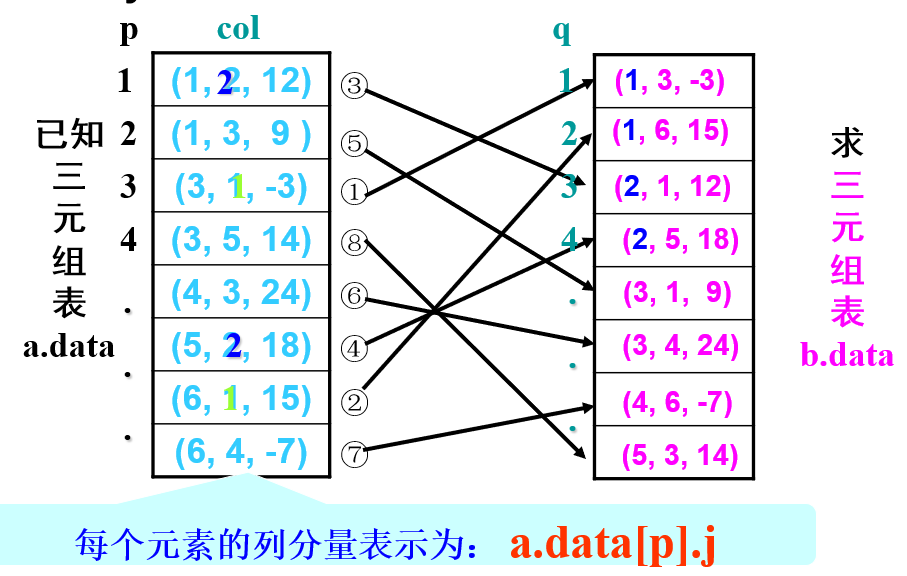{:width=200 height=200}
需要反复遍历三元组表，以找到j=对应值的三元组。O(n^2^)的时间复杂度
###### 快速转置
依次把原三元组表中的元素直接送入新三元组表的恰当位置上（即M三元组的p指针不回溯）
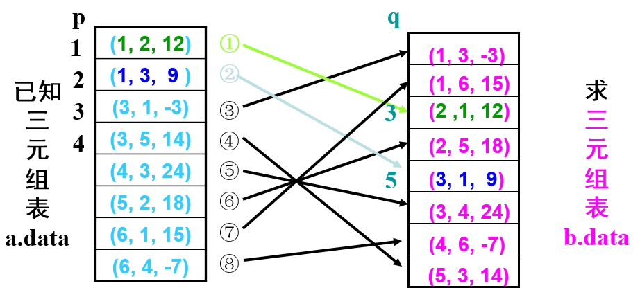{:width=200 height=200}
关键在于如何寻找“恰当位置”：
当知道原来矩阵每一列（即新矩阵每一行）的非零元素个数，又知道每列的第一个非零元素在新矩阵的位置（是第几个非0元素），则遍历原三元组表是就可以将每个元素定位到新表上。
所以要按列生成原矩阵的两个辅助向量，标识每列的非零元素个数`NUM(i)`以及每列的第一个非零元素在三元组表中的位置`POS(i)`，这两个变量的含义类似于压缩存储的辅助向量。
令原矩阵中的列变量用`col`表示，`num[col]`存放原矩阵中第col列中非0元素个数，`cpos[col]`存放原矩阵中第col列的第一个非0元素的位置
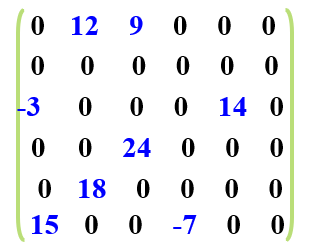{:width=100 height=100}
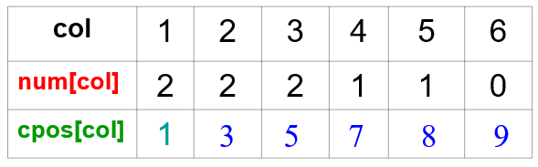{:width=100 height=100}
最后的cpos数组是想要的。
从原三元组表的第一个元素开始，我们需要找到该元素的j值（即这个数在第几列），设为`col`。以第一个元素`12`为例，它的`col`为2，对应的`cpos[col]`为3，这就是该元素在新表中的位置，因为新表就是按行（原来的列）排的。
之后又进行遍历，直到遇到原矩阵第2列的`18`，它的`cpos[col]`也为3，但该位置已经被`12`占用。所以在第一次添加`12`的时候，需要把它对应的`cpos[col]`加1，这样18获取的`cpos[col]`就是4，是一个新的位置，可以进行添加。
```
//M是顺序存储的三元组表，求M的转置矩阵T
TSMatrix fastTransposeMatrix(TSMatrix M,TSMatrix T){
	//第1步：行和列置换
	T.m=M.n; //新表的列数=旧表的行数
	T.n=M.m; //新表的行数=旧表的列数
	T.num=M.num; //新旧表的总元素数相等
	if (T.num == 0) 
		return NULL;
	//计算array数组（即上面的num[]数组）
	int array[number];
	for (int col=1; col<=M.m; col++) {
		array[col]=0;
	} //将所有元素初始化为0
	for (int t=0; t<M.num; t++) {
		int j=M.data[t].j; //获取每个元素的列值（是哪列）
		array[j]++; //对应列的元素总数+1
	}
	//创建并初始化cpot数组（即上面的cpos[]数组）
	int cpot[T.m+1];
	cpot[1]=1;
	for (int col=2; col<=M.m; col++) {
		cpot[col]=cpot[col-1]+array[col-1];
	} //根据前面推导的公式计算cpos
	//只遍历一次即可实现三元组表的转置
	for (int p=0; p<M.num; p++) {
		int col=M.data[p].j; //获取当前元素的col值
		int q=cpot[col]; //当前元素要存放在新表中的位置
		T.data[q-1].i=M.data[p].j; //转置矩阵的三元组默认从数组下标0开始，而得到的q值是单纯的位置，所以要减1
		T.data[q-1].j=M.data[p].i;
		T.data[q-1].data=M.data[p].data; //向新表中写入数据
		cpot[col]++; //不要忘了+1
	}
	return T;
}
```
### 应用
##### 找子串
###### BF算法
关键在于**回溯**操作--在主串中的元素和子串中的元素发生不匹配的情况时进行，回溯操作是针对于**主串**来说的
{:width=200 height=200}
从主串的第一个字符开始与子串的第一个字符进行比较，如果相等就让i，j的位置往后移动；等到遇到不一样的字符，就i指向主串S的第二个元素，而此时j指向子串T的第一个元素然后再次进行匹配操作。
回溯操作公式：`i=i-j+2`，如上图，i=4且j=4，现要使i=2
如果i和j从0开始，就是`i=i-j+1`
***
时间复杂度：
设主串的长度为n ，子串的长度为m
- 最好情况下，每趟不成功的匹配都发生在模拟串的第一个字符与主串中相应字符的比较。匹配成功的平均比较次数为`(n+m)/2`，平均时间复杂度为`O(n+m)`
- 最坏情况下，每趟不成功的匹配都发生在模拟串的最后一个字符与主串中相应字符的比较。匹配成功的平均比较次数为`m*(n-m+2)/2`，最坏情况下的平均时间复杂度为`O(n*m)`
###### KMP算法
一个基础概念--最长相等前后缀
对于字符串`abcdab`
- 前缀的集合：`{a,ab,abc,abcd,abcda}`，就是取字符串的前n个字符
- 后缀的集合：`{b,ab,dab,cdab,bcdab}`，就是取字符串的后n个字符

最长相等前后缀就是两个集合最长的交集元素`ab`
例：`abcabfabcab`的最长相等前后缀--`abcab`
***
如图
{:width=150 height=150}
用第一个长条代表主串`abcabeabcabcmn`，第二个长条代表子串`abcabcmn`，绿色和蓝色部分分别代表主串和子串中不匹配的字符
{:width=70 height=70}
现在需要**对子串进行移动**
{:width=150 height=150}
{:width=70 height=70}
灰色部分就是红色部分字符串的最长相等前后缀，子串移动的结果就是让子串的红色部分最长相等前缀和主串红色部分最长相等后缀对齐。
{:width=150 height=150}
{:width=70 height=70}
**每一个字符前的字符串都有最长相等前后缀**，单独用一个next数组存储子串的最长相等前后缀的长度，该数组值只与子串有关
`next[i]=j`表示`下标为i的字符前的字符串最长相等前后缀的长度为j`
| a       | b       | c       | a       | b       | c       | m       | n       |
| ------- | ------- | ------- | ------- | ------- | ------- | ------- | ------- |
| next[0] | next[1] | next[2] | next[3] | next[4] | next[5] | next[6] | next[7] |
| -1      | 0       | 0       | 0       | 1       | 2       | 3       | 0       |

本例中的蓝色c处出现了不匹配，即`s[5]!=t[5]`
{:width=70 height=70}
把子串移动，也就是让`s[5]`与`t[5]`前面字符串的最长相等前缀后一个字符`t[2]`再比较，
{:width=70 height=70}
而这个2也是不匹配的字符前的字符串 最长相等前后缀的长度`next[5]`。
于是可以说next数组有2个作用：
- 表示该处字符不匹配时应该回溯到的字符的下标
- 表示移动后要比较的子串字符的位置（子串的最长相等前缀的后一个字符）
***
求next数组：
```
void _get_next(hstring& h, int next[])
{
	int j = 0, k = -1;
	next[0] = -1; //第一个字符前无字符串，给值-1
	while (j < h.length - 1) //因为next数组中j最大为t.length-1,而每一步next数组赋值都是在j++之后
	//所以最后一次经过while循环时j为t.length-2
	{
		if (k == -1 || h.ch[j] == h.ch[k])
		{
			j++;
			k++;
			next[j] = k;
		}
		else
		{
			k = next[k];
		}
	}
}
```
如图，用长条表示子串，红色部分代表当前匹配上的最长相等前后缀，蓝色部分代表`t.data[j]`
{:width=250 height=250}
{:width=200 height=200}
###### 手算next数组
我们能确定next数组第一二位一定分别为0、1，后面求解每一位的next值时，根据前一位进行比较。
从第三位开始，将**前一位**与它的next值对应的字符（下标为它的next值的那个字符）进行比较：
- 如果相等，则该位的next值就是前一位的next值加上1；
- 如果不等，向前继续寻找next值对应的内容来与前一位进行比较，直到找到某个位上内容的next值对应的字符与**前一位**相等为止，则这个位对应的值加上1即为需求的next值；

如果找到第一位都没有找到与前一位相等的内容，那么求解的位上的next值为1。
https://blog.csdn.net/m0_37482190/article/details/86667059
***
**根据首尾字符和next数组推导原字符串：**
设next数组为`011234223456`，字符串只由`a`和`b`组成，首尾字符均为`a`
**1.** 根据第三位的1，可知第二个字符与第一个字符不等（如果相等该处next值就应为2），所以第二个字符为b
**2.** 第4位为2，可知第三个字符与它的next值(`1`)对应的字符（第1个字符）相等，所以第三个字符为a
**3.** 5-3，第4个字符与第2个字符相等，为b
**4.** 6-4，第5个字符与第3个字符相等，为a
**5.** 7-2，第6个字符与第4个字符不等（如果相等该处next值就应为5），为a
**6.** 8-2，第7个字符与第2个字符不等（如果相等该处next值就应为3），为a
**7.** 9-3，第8个字符与第2个字符相等，为b
**8.** 10-4，第9个字符与第3个字符相等，为a
**9.** 11-5，第10个字符与第4个字符相等，为b
**10.** 12-6，第11个字符与第5个字符相等，为a
于是得到字符串为`ababaaababaa`
##### 一元多项式的加法与乘法运算
输入：分2行，每行分别先给出多项式非零项的个数，再以指数递降方式输入一个多项式非零项系数和指数（绝对值均为不超过1000的整数）。数字间以空格分隔。
***
加法及录入数据：
声明变量：n和m3代表两个多项式非0项的个数；a和b存储非零项系数，a1和b1存储对应的指数；d代表用顺序储存结构存储的加法运算结果数组，即d[i]表示指数为i项的系数
```
cin >> n;
for (i = 0; i < n; i++)
{
	cin >> a[i] >> a1[i]; 
	d[a1[i]] += a[i]; //这里直接把加法算了
}
cin >> m3;
for (i = 0; i < m3; i++)
{
	cin >> b[i] >> b1[i];
	d[b1[i]] += b[i]; //这里直接把加法算了
}
```
***
乘法：
声明变量：c存储乘完后多项式的系数，c1存储对应的指数；h用顺序储存结构存储的乘法运算结果数组
```
k = 0; //k表示该次循环的结果应存入c和c1的索引
for (i = 0; i < n; i++)
{
	for (j = 0; j < m3; j++)
	{
		c[k] = a[i] * b[j];
		c1[k] = a1[i] + b1[j]; //多项式相乘，系数相乘，指数相加；
		h[c1[k]] += c[k]; 
		k++;
	}
}
```
***
若让指数从大到小输出，就遍历两个结果数组，从它们的尾部开始，如果储存的系数不是0就输出索引（指数）和值（系数）
##### 两个有序链表合并
将两个链表表示的递增整数序列合并为一个非递减的整数序列。
思路：双指针分别指向两个链表，从前往后移动，当`p1<p2`时将p1加入到结果链表中 同时p1向后移，否则p2放入结果链表中 同时p2向后移。
```
List Merge(List L1, List L2)
{
	List pa, pb, pc;
	List L = (List)malloc(sizeof(struct Node));
	pa = L1->Next;
	pb = L2->Next;
	pc = L; //结果链表的指针，开始时指向头节点
	while (pa && pb)
	{
		if (pa->Data <= pb->Data)
		{
			pc->Next = pa; //pa指向的节点放入结果链表中
			pc = pa;
			pa = pa->Next; //pa向后移动
		}
		else
		{
			pc->Next = pb;
			pc = pb;
			pb = pb->Next;
		}
	}
	pc->Next = pa ? pa : pb;  //如果pa不为空，pc->Next = pa，否则pc->Next = pb
	L1->Next = NULL;
	L2->Next = NULL;
	return L;
}
```
##### 颠倒链表
给定一个常数K和一个单链表L，把L上所有K个元素的链接都颠倒过来。例如，给定L为1→2→3→4→5→6，如果K=3，那么输出3→2→1→6→5→4；如果K=4，输出4→3→2→1→5→6。即每K个节点反转一次。
输入：第一行为`第一个节点地址 结点总数 K`，剩下每一行描述一个结点的格式为`Address Data Next`，其中Address是结点的位置，Data是一个整数，Next是下一个节点的位置。颠倒时要将数据和地址同时颠倒如：
```
00100 6 4
00000 4 99999
00100 1 12309
68237 6 -1
33218 3 00000
99999 5 68237
12309 2 33218
```
显然这是一个未排列好的链表，正常情况一个节点的next值=下一个节点的address。
###### 录入数据及有效数据统计
录入数据：直接采用稀疏数组，创建一个结点数组，题中给的地址作为索引存储节点
```
typedef struct node {
	ElementType data;
	ElementType next;
} Node; //节点定义，包括数据和next值
Node list[MAXSIZE];
int Head, N, K;  //Head为第一个结点的地址,N为结点的总数，K为要反转的子列表的长度
cin >> Head >> N >> K;
int i, Address, Data, Next;  //Address是结点的位置，Data是一个整数，Next是下一个结点的位置
for (i = 0; i < N; i++) 
{
	cin >> Address >> Data >> Next;
	list[Address].data = Data;
	list[Address].next = Next;
}
int num = 1;//所给数据结点并不都是链表中的结点，用于计数真正的结点个数 
while (list[next].next != -1) {
	num++;
	next = list[next].next;
}
```
###### 头插法反转链表
头插法--在插入时，新的结点插入到当前链表的表头：
`1 2 3 4`四个节点，`for(int i=1;i<=4;i++)`让第i个节点插入到这个链表的最前面。`1 2 3 4`->`2 1 3 4`->`3 2 1 4`->`4 3 2 1`。关键点在于新创建的节点要指向原第一个节点，头节点指向这个新创建的节点。
一个简单的例子：
```
STU*p=phead->next; //p是头节点后的第一个节点（有数据的第一个节点），以下简称为第一个节点
phead->next=NULL; //断开头节点与后面节点的连接
STU*q; //保存p后的那个节点
//p始终指向要插入到头部的那个节点，phead始终指向头节点
while(p!=NULL){
	q=p->next; //q保存要插入到头部的那个节点之后的那个节点地址（因为下一次循环要把它插入到头部，这里必须保存，要不待会改p->next就获取不到这个节点了）
	p->next=phead->next; //phead->next为原第一个节点地址，要插入到头部的那个节点 的next应为原来的第一个节点地址
	phead->next=p; //更改第一个节点为p
	p=q; //确定下一个要移动的节点
}
```
***
下面做法更改了确定下一个要移动的节点的方法，观察`1 2 3 4`->`2 1 3 4`->`3 2 1 4`->`4 3 2 1`可知，要移动的节点始终使最开始的第一个节点`1`的下一个节点。
```
int K,head,N; //head为第一个结点的地址,N为结点的总数，K为要反转的子列表的长度
int flag = 1; //是否为第一次翻转
int last_head; //用于记录上一次反转后，子链表的最后结点地址，待与下一次反转的子链表的头部相连
int rev_head = head; //下一次待反转子链表的头结点地址
int mid_head = head; //反转过程中的中间结点地址
while (N - K >= 0) //当剩余结点不够K个时，则不再反转 
{
	N -= K;
	//反转子链表 
	for (int i = 0; i < K - 1; i++) 
	{
        //rev_head始终指向原第一个节点，它的next（mid_next）就是要移动的那个节点的地址
		mid_next = list[rev_head].next;
		list[rev_head].next = list[mid_next].next; //使要移动的那个节点之前的节点rev_head的next值为要移动的那个节点之后的那个节点的地址list[mid_next].next
		list[mid_next].next = mid_head; //要移动的那个节点的next指向头节点
		mid_head = mid_next; //更新头节点地址
	}//反转子链表
	if (flag == 0) //从第二次开始，需要把这次反转后的子链表的头结点连接到上一段的尾部 
	{
		list[last_head].next = mid_head;
	}
	if (flag) //记录第一次反转后的头结点，作为最终List的头结点并返回 
	{
		head = mid_head;
		flag = 0;
	}
	last_head = rev_head;
	rev_head = list[rev_head].next;//下次开始的头结点地址 
	mid_head = rev_head;
}
```
##### 出栈的可能顺序
给出若干序列，检测每个序列（每个数字池）能否通过指定大小的栈pop得到，入栈顺序：1,2,...,N。
输入第一行：M（栈的最大容量）、N（要检测的数字有多少个）、K（有多少组要检测的数字）；后K行每行N个数字，代表要检测的数组；输出：如果可以通过栈的pop得到则输出YES，否则输出NO。

思路:不是找不能/可以出栈的序列规律，而是对每一个给定序列进行模拟，来判断是否可行。
给定数列是通过在1、2...依次入栈的过程中，在某个数入栈后立即抛出，之后要么接着抛出栈中的下一个数，要么继续入栈过程。
要想逆推这个过程，就需要我们把数依次入栈，同时比较这个数与给定序列的第一个数，若相等就抛出、并接着比较栈内的下一个数与给定序列的下一个数，若不等就继续入栈。
直至全部比较完成——该序列满足条件，或者入栈过程中栈内元素数量超过了M/未全部比较完成而入栈过程已完毕——不满足条件
```
int M, N, K;
cin >> M >> N >> K;
while (K--)   //k是总共需要判断的序列数量，k--控制判断次数
{
	vector<int> pool(N, 0); 
	for (int i = 0; i < N; ++i) //输入一个数字池
		cin >> pool[i];
	int flag = 1, ru_zhan = 1; //ru_zhan是入栈的那个数
	int pa = 0; //pool中元素的索引
	stack<int> stack_now;
	while (ru_zhan <= N) //最后一个入栈的数是N
	{
		stack_now.push(ru_zhan); //入栈一个数
		ru_zhan++; //下一个要入栈的数比当前大1
		if (stack_now.size() > M) //如果栈中的元素数量超过了最大允许元素数，就不行。注意这里不是栈顶值比M大，而是数量
		{
			flag = 0;
			break;
		}
		while (!stack_now.empty() && pa < N && pool[pa] == stack_now.top())//当栈顶元素等于要验证的第pa个pool中元素，且pa在规定范围内（未验证完）时，
		{
			pa++;//该元素验证成功，该验证下一个元素
			stack_now.pop();//栈顶元素被抛出
		}//这里要用循环，因为可能入栈一个元素但抛出多个元素
	}
	if (pa < N) flag = 0;  //未验证完，不行
	if (flag==0) cout << "NO" << endl;
	else cout << "YES" << endl;
}
return 0;
```