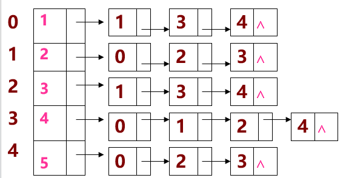

<a id="mulu">目录</a>
<a href="#mulu" class="back">回到目录</a>

<!-- @import "[TOC]" {cmd="toc" depthFrom=3 depthTo=6 orderedList=false} -->

<!-- code_chunk_output -->

- [一些基本概念](#一些基本概念)
- [存储](#存储)
    - [邻接矩阵（数组）表示法](#邻接矩阵数组表示法)
    - [邻接表（链式）表示法](#邻接表链式表示法)
- [遍历](#遍历)
    - [深度优先搜索(DFS)](#深度优先搜索dfs)
    - [广度优先搜索(BFS)](#广度优先搜索bfs)
- [图的连通性](#图的连通性)
- [最短路径问题](#最短路径问题)
    - [求从某个源点到其余各顶点的最短路径](#求从某个源点到其余各顶点的最短路径)
    - [每一对顶点之间的最短路径](#每一对顶点之间的最短路径)
- [应用](#应用)
    - [拓扑排序](#拓扑排序)
    - [求关键路径](#求关键路径)

<!-- /code_chunk_output -->

<!-- 打开侧边预览：f1->Markdown Preview Enhanced: open...
只有打开侧边预览时保存才自动更新目录 -->

### 一些基本概念
有向图：图G中的每条边都是有方向的；
无向图：图G中的每条边都是无方向的；
完全图：图G任意两个顶点都有一条边相连接；

### 存储
##### 邻接矩阵（数组）表示法
1. 建立一个顶点表（记录各个顶点信息）和一个邻接矩阵（表示各个顶点之间关系）。
2. 设图`A=(V,E)`有n个顶点，则图的邻接矩阵是一个二维数组`A.Edge[n][n]`；对于无向图，若第i个顶点和第j个顶点相连，则`A.Edge[i][j]`与`A.Edge[j][i]`都为1，否则为0；对于有向图，若第i个顶点指向第j个顶点，则`A.Edge[i][j]=0` `A.Edge[j][i]=1`
***
例1--无向图：
{:width=150 height=150}
分析1：无向图的邻接矩阵是对称的；
分析2：顶点i的度＝第i行/列中1的个数；
特别：完全图的邻接矩阵中，对角元素为0，其余全1。
***
例2--有向图：
{:width=150 height=150}
在有向图的邻接矩阵中，
第i行表示以结点vi为尾的弧（即出度边）；
第i列表示以结点vi为头的弧（即入度边）。
有向图的邻接矩阵可能是不对称的。
***
例3--有权图：
第i个顶点指向第j个顶点的权值为n，则`A.Edge[j][i]=n`，其它值为∞
{:width=150 height=150}
***
优点：容易实现图的操作，如：求某顶点的度、判断顶点之间是否有边（弧）、找顶点的邻接点等等。
缺点：n个顶点需要n*n个单元存储边(弧);空间效率为O(n^2^)。
##### 邻接表（链式）表示法
1. 对每个顶点vi 建立一个单链表，把与vi有关联的边的信息（即度或出度边）链接起来，表中每个结点都设为3个域；
2. 每个单链表还应当附设一个头结点（设为2个域），存vi信息；
{:width=100 height=100}
3. 每个单链表的头结点另外用顺序存储结构存储。
***
例1--无向图：
{:width=150 height=150}
v1与v2和v4相连，而v2和v4的索引分别为1和3，所以v1对应的链表数据域为3和1；
v3与v2、v4和v5相连，它们的索引分别为1、3和4，所以v3对应的链表数据域为4、3和1；
以此类推...
注意：**邻接表不唯一**，因为各个边结点的链入顺序是任意的。
***
例2--有向图：
{:width=150 height=150}
其中v1为起点的边有v2和v3，索引为1和2，所以v1的出边邻接表数据域为2和1；v1为终点的边只有v4，索引为3，所以v1的入边邻接表数据域为3；
以此类推...
***
**当邻接表的存储结构形成后，图便唯一确定**
例3：已知某网的邻接（出边）表，请画出该网络。
{:width=250 height=250}
***
邻接表存储法是对邻接矩阵法的改进：
1. 对于n个顶点e条边的无向图，邻接表中除了n个头结点外，只有2e个表结点,空间效率为O(n+2e)。若是稀疏图(e<<n2)，则比邻接矩阵表示法O(n2)省空间。
2. 在有向图中，邻接表中除了n个头结点外，只有e个表结点,空间效率为O(n+e)。若是稀疏图，则比邻接矩阵表示法合适。

优点：空间效率高；容易寻找顶点的邻接点；
缺点：判断两顶点间是否有边或弧，需搜索两结点对应的单链表，没有邻接矩阵方便。
***
两种方法的比较：
- 联系：邻接表中每个链表对应于邻接矩阵中的一行，链表中结点个数等于一行中非零元素的个数。
- 区别：
  - 对于任一确定的无向图，**邻接矩阵是唯一的**（行列号与顶点编号一致），但**邻接表不唯一**（链接次序与顶点编号无关）。
  - 邻接矩阵的空间复杂度为O(n^2^),而邻接表的空间复杂度为O(n+e)。
- 用途：
  - 邻接矩阵多用于稠密图的存储（e接近`n(n-1)/2`）
  - 而邻接表多用于稀疏图的存储（e<<n^2^）
### 遍历
遍历：从已给的连通图中某一顶点出发，沿着一些边，访遍图中所有的顶点，且使每个顶点仅被访问一次，就叫做图的遍历，它是图的基本运算。
实质：找每个顶点的邻接点的过程。
特点：图中可能存在回路，且图的任一顶点都可能与其它顶点相通，在访问完某个顶点之后可能会沿着某些边又回到了曾经访问过的顶点。
解决思路：可设置一个辅助数组`visited[n]`，用来标记每个被访问过的顶点。它的初始状态为0，在图的遍历过程中，一旦某一个顶点`i`被访问，就立即改`visited[i]`为1，防止它被多次访问。
##### 深度优先搜索(DFS)
基本思想：仿树的先序遍历过程（使用递归）
基本过程：
- 访问起始点`v`;
- 若`v`的第1个邻接点没访问过，深度遍历此邻接点；
- 若当前邻接点已访问过，再找v的第2个邻接点重新遍历。
具体过程：
- 在访问图中某一起始顶点`v`后，由`v`出发，访问它的任一邻接顶点`w1`；
- 再从`w1`出发，访问与`w1`邻接但还未被访问过的顶点`w2`；
- 然后再从`w2`出发，进行类似的访问，直至到达所有的邻接顶点都被访问过的顶点`u`为止。
- 接着，退回一步，退到前一次刚访问过的顶点，看是否还有其它未被访问的邻接顶点。
    - 如果有，则访问此顶点，之后再从此顶点出发，进行与前述类似的访问；
    - 如果没有，就再退回一步进行搜索。重复上述过程，直到连通图中所有顶点都被访问过为止。
***
例1：
{:width=150 height=150}
其中`v5->v3`就是v5回退到v8再回退到v4、v2、v1，`v6->v7`是v6回退到v3
例2：
{:width=150 height=150}
其中`v5->v4`就是v5回退到v3、v1
##### 广度优先搜索(BFS)
基本思想：仿树的层次遍历过程。
基本过程：
- 在访问了起始点`v`之后，依次访问`v`的邻接点；
- 然后再依次（顺序）访问这些点（下一层）中未被访问过的邻接点；直到所有顶点都被访问过为止。

注意：广度优先搜索是一种分层的搜索过程，每向前走一步可能访问一批顶点，不像深度优先搜索那样有回退的情况。因此，广度优先搜索不是一个递归的过程，其算法也不是递归的，而是利用队列。BFS的遍历算法也需辅助数组
***
例：
{:width=150 height=150}
***
算法过程：
对于图
{:width=80 height=80}
{:width=150 height=150}
- 访问结点3，入队。第一次循环：结点3出队，找其第一个邻接点2，2未访问过，访问之并入队；找下一个邻接点4，访问之并入队；找下一个邻接点5，访问之并入队
- 第二次循环：结点2出队，找其第一个邻接点1，访问、入队；下一个邻接点3，访问过；下一个邻接点4，访问过。
- 第三次循环：结点4出队，依次找其邻接点1、2、3、5均访问过
- 第四次循环：结点5出队，依次找其邻接点1、3、4均访问过
- 第五次循环：结点1出队，依次找其邻接点2、4、5均访问过。此时队列为空，遍历结束，遍历序列为：3、2、4、5、1
***
遍历算法总结：
- 遍历图的过程实质上是通过边或弧找邻接点的过程，因此DFS和BFS的时间复杂度是相同的。
- 对于一个图，它的DFS和BFS的搜索顺序不唯一，是由该图的存储结构决定的。
- 如果从无向图的任一顶点出发进行**一次**深度优先搜索即可访问所有顶点，则该图一定是连通图。
- 对于非连通图的遍历过程中每调用一次DFS算法都得到该图的一个连通分量。
### 图的连通性
连通图：在无向图中，若从顶点v1到顶点v2有路径，则称顶点v1与v2是连通的。如果图中任意一对顶点都是连通的，则称此图是连通图。
连通分量：非连通图的极大连通子图叫做连通分量。
生成树：是一个极小连通子图，它含有图中全部n个顶点，但只有n-1条边。
- 如果在生成树上添加1条边，必定构成一个环。
- 若图中有n个顶点，却少于n-1条边，必为非连通图。
构造生成树的准则：
- 必须只使用该网络中的边来构造生成树；
- 必须使用且仅使用n-1条边来联结网络中的n个顶点；
- 不能使用产生回路的边。
最小生成树的两种算法：
1. Prim算法：取图中任意一个顶点v作为生成树的根，之后往生成树上添加新的顶点w。在添加的顶点w和已经在生成树上的顶点v之间必定存在一条边，并且该边的权值在所有连通顶点v和w之间的边中取值最小。之后继续往生成树上添加顶点，直至生成树上含有n-1个顶点为止。时间复杂度为O(n^2^)
2. Kruskal算法：为使生成树上边的权值之和达到最小，则应使生成树中每一条边的权值尽可能地小。先构造一个只含n个顶点的子图SG，然后从权值最小的边开始，若它的添加不使SG中产生回路，则在SG上加上这条边，如此重复，直至加上n-1条边为止。时间复杂度为O(eloge)
### 最短路径问题
##### 求从某个源点到其余各顶点的最短路径
迪杰斯特拉算法：设置辅助数组Dist，其中每个分量`Dist[k]`表示`当前所求得的从源点到其余各顶点k的最短路径`。一般情况下，`Dist[k]`=`<源点到顶点k的弧上的权值>`或者=`<源点到其它顶点的路径长度>`+`<其它顶点到顶点k的弧上的权值>`
- 在所有从源点出发的弧中选取一条权值最小的弧，即为第一条最短路径。
{:width=50 height=50}
其中的最小值即为最短路径的长度。
- 修改其它各顶点的`Dist[k]`值：假设求得最短路径的顶点为`u`，若`Dist[u]`+`G.arcs[u][k]`<`Dist[k]`，则将`Dist[k]`改为`Dist[u]`+`G.arcs[u][k]`
##### 每一对顶点之间的最短路径
Floyd算法：从vi到vj的所有可能存在的路径中，选出一条长度最短的路径。
### 应用
##### 拓扑排序
按照有向图给出的次序关系，将图中顶点排成一个线性序列，对于有向图中没有限定次序关系的顶点，则可以人为加上任意的次序关系。由此所得顶点的线性序列称之为拓扑有序序列。
对于下列有向图
{:width=50 height=50}
可求得拓扑有序序列：`A B C D`或`A C B D`
而对于下列有向图
{:width=50 height=50}
不能求得它的拓扑有序序列。因为图中存在一个回路`{B, C, D}`
**拓扑排序的前提是图中没有回路**
***
如何进行拓扑排序：
- 从有向图中选取一个没有前驱的顶点，并输出之；
- 从有向图中删去此顶点以及所有以它为尾的弧；
重复上述两步，直至图空，或者图不空但找不到无前驱的顶点为止。
例：
{:width=100 height=100}
拓扑有序序列：`a b h c d g f e`
##### 求关键路径
假设以有向网表示一个施工流图，其中，顶点表示事件，弧表示活动，弧上的权值表示活动的持续时间。
整个工程完成的时间为：从有向图的源点到汇点的最长路径。
{:width=100 height=100}
“关键活动”指的是：该弧上的权值增加将使有向图上的最长路径的长度增加。
求解关键路径需要的4个描述量：https://blog.csdn.net/weixin_46072771/article/details/106673063
如何计算：https://blog.csdn.net/u011587070/article/details/82773820