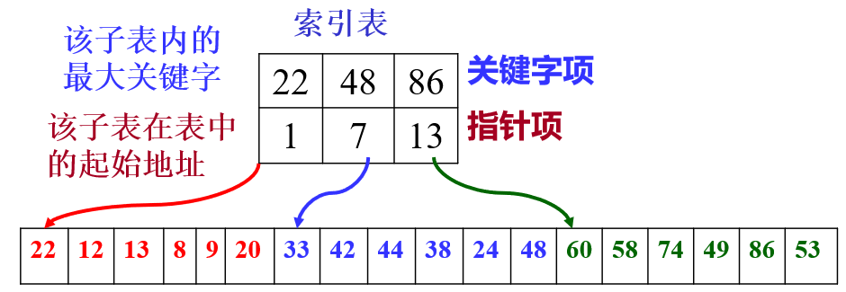
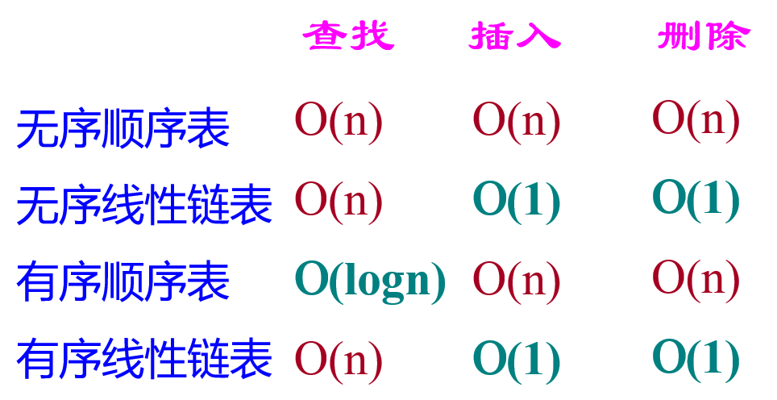
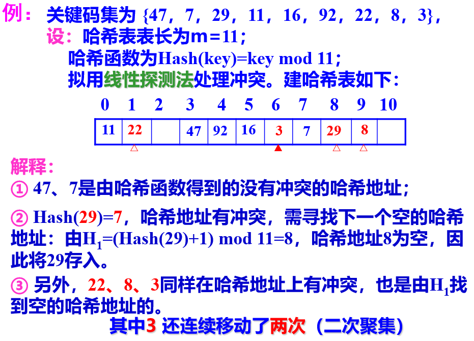
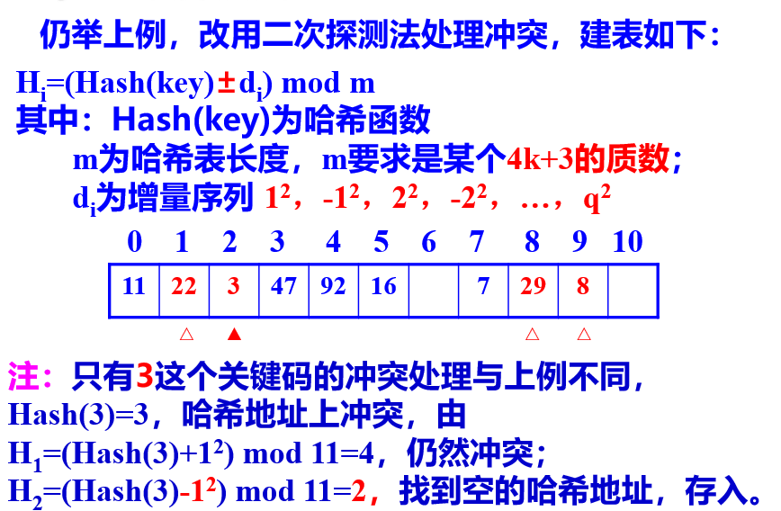
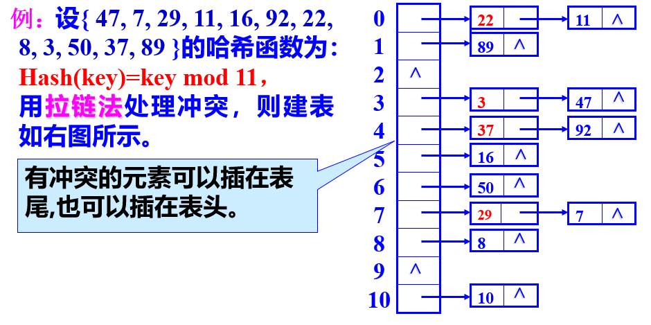

<a id="mulu">目录</a>
<a href="#mulu" class="back">回到目录</a>

<!-- @import "[TOC]" {cmd="toc" depthFrom=3 depthTo=6 orderedList=false} -->

<!-- code_chunk_output -->

- [基本概念](#基本概念)
- [静态查找表](#静态查找表)
    - [顺序查找表](#顺序查找表)
    - [有序查找表](#有序查找表)
    - [索引顺序表](#索引顺序表)
- [动态查找表](#动态查找表)
    - [B-树（不考）](#b-树不考)
    - [哈希表](#哈希表)
      - [哈希函数的构造方法](#哈希函数的构造方法)
      - [冲突处理方法](#冲突处理方法)

<!-- /code_chunk_output -->

<!-- 打开侧边预览：f1->Markdown Preview Enhanced: open...
只有打开侧边预览时保存才自动更新目录 -->

### 基本概念
**查找表**：由同一类型的数据元素(或记录)构成的集合。
操作：
- **查询**某个特定数据元素是否在查找表中
- **检索**某个特定数据元素的各种属性
- 在查找表中**插入**一个数据元素
- 从查找表中**删去**某个数据元素

查找表可分为两类:
- **静态查找表**：仅作查询和检索操作的查找表
- **动态查找表**：将“查询”结果为“不在查找表中”的数据元素插入到查找表中，或从查找表中删除其“查询”结果为“在查找表中”的数据元素
***
**关键字**：是数据元素中某个数据项的值，用以标识一个数据元素
- **主关键字**：此关键字可以识别唯一的一个记录
- **次关键字**：此关键字能识别若干记录
***
**平均搜索长度ASL**(Average Search Length)：在搜索过程中关键码的平均比较次数，通常是搜索结构中对象总数n的函数。
### 静态查找表
##### 顺序查找表
即以顺序表或线性链表表示静态查找表
**顺序查找**(Sequential Search)：主要用于在线性结构中进行查找。设若表中有n个对象，则顺序查找从表的先端开始，顺序用各对象的关键码与给定值x进行比较，直到找到与其值相等的对象，则查找成功，给出该对象在表中的位置；若整个表都已检测完仍未找到关键码与x相等的对象，则查找失败。
平均比较次数`(1+2+3+...+n-1+n)/n = (n+1)/2`，ASL约为表长的一半
##### 有序查找表
若以**有序表**表示静态查找表，则查找过程可以基于“折半”进行。
基于有序顺序表的折半搜索（二分搜索）:
- 设n个对象存放在一个有序顺序表中，并按其关键字从小到大排好了序。
- 采用折半查找时，先求位于查找区间正中的对象的下标mid，用其关键码与给定值x比较:
  - Elem[mid].Key = x，查找成功；
  - Elem[mid].Key > x，把查找区间缩小到表的前半部分，再继续进行折半查找；
  - Elem[mid].Key < x，把查找区间缩小到表的后半部分，再继续进行折半查找。
- 每比较一次，查找区间缩小一半。如果查找区间已缩小到一个对象，仍未找到想要查找的对象，则查找失败。

折半查找过程可用二叉判定树来描述：表长为n的折半查找的判定树深度和含n个结点的完全二叉树的深度相同，折半查找在查找成功时关键字比较次数不超过树的深度 [log~2~n]+1。
折半查找效率比顺序查找高，但折半查找**只适用于有序表，且限于顺序存储结构**
##### 索引顺序表
分块有序原则：第二个子表的所有记录的关键字均大于第一个字表中的最大关键字，依此类推...
{:width=120 height=120}
查找过程：
- 由索引确定记录所在块（子表）
- 在子表（顺序表）的某个块内进行顺序查找

可见，索引顺序查找的过程也是一个“**缩小区间**”的查找过程。
索引表中的索引项是按关键字有序排列的，因此可用顺序查找，也可用折半查找；而块（子表）中的记录是任意排列的，只能用顺序查找的方法。
`索引顺序查找的平均查找长度`=`查找“索引”的平均查找长度`+`查找“顺序表”的平均查找长度`
***
总结：查找表的特性
{:width=150 height=150}
从查找性能看，最好情况能达O(logn)，此时要求表有序；
从插入和删除的性能看，最好情况能达O(1)，此时要求存储结构是链表。
### 动态查找表
见[03树](03树.md)中**二叉搜索树**与**平衡二叉树**
##### B-树（不考）
PPT上无，课讲
https://blog.csdn.net/fengyuyeguirenenen/article/details/122788353
B-树的查找是二叉排序树的扩展--二叉排序树是二路查找，B-树是多路查找，因为B-树结点内的关键字是有序的，在结点内进行查找时除了顺序查找外，还可以用折半查找来提升效率。
{:width=120 height=120}
B-树的阶指树的所有结点中孩子结点个数的最大值，通常用m表示(一般m>=3)。每个结点的结构为：
{:width=80 height=80}
`n`为该结点中关键字的个数；`ki`为该结点的关键字；`pi`为该结点的孩子结点指针
要求：
- `pi`所指结点上的关键字大于`ki`且小于`ki`+1，`p0`所指结点上的关键字小于`k1`，`pn`所指结点上的关键字大于`kn`
- 每个结点最多有m个分支
- 如果一个结点有n-1个关键字，那么该结点有n个分支。这n-1个关键字各不相同且按照递增顺序排列。
##### 哈希表
即散列存储结构：建立**关键码字与其存储位置的对应关系**，即由**关键码的值决定数据的存储地址**
优点：查找速度极快`O(1)`,查找效率与元素个数n无关
例：将学生信息按如下方式存入计算机，如
将`2001011810201`的所有信息存入V[01]单元；
将`2001011810202`的所有信息存入V[02]单元；
...
将`2001011810231`的所有信息存入V[31]单元。
欲查找学号为`2001011810216`的信息，便可直接访问V[16]
***
**Hash查找法**：选取某个函数，依该函数按关键字计算元素的存储位置并按此存放；查找时也由同一个函数对给定值k计算地址，将k与地址中内容进行比较，确定查找是否成功。
这个函数称为**哈希函数**，构造出的表称为**哈希表**。
通常关键码的集合比哈希地址集合大得多，因而经过哈希函数变换后，可能将不同的关键码映射到同一个哈希地址上，这种现象称为**冲突**。
在哈希查找方法中，**冲突是不可能避免的**，只能尽可能减少。
哈希方法必须解决以下两个问题：
- **好的哈希函数**：尽可能**简单**，以便提高转换速度；所选函数对关键码计算出的地址，应在哈希地址内集中并大致**均匀**分布，以减少空间浪费。
- **制定一个好的解决冲突的方案**：查找时，如果从哈希函数计算出的地址中查不到关键码，则应当依据解决冲突的规则，**有规律地**查询其它相关单元。
###### 哈希函数的构造方法
要求一：n个数据原仅占用n个地址，虽然散列查找是以空间换时间，但仍希望散列的地址空间尽量小。
要求二：无论用什么方法存储，目的都是尽量均匀地存放元素，以避免冲突。
常用的哈希函数构造方法有：直接定址法、除留余数法、乘余取整法、数字分析法、平方取中法、折叠法、随机数法 
###### 冲突处理方法
1. 开放定址法（开地址法）--重点：有冲突时就去寻找下一个空的哈希地址，只要哈希表足够大，空的哈希地址总能找到，并将数据元素存入。
   -  线性探测法：一旦冲突，就找附近（下一个）空地址存入。
  {:width=250 height=250}
  ASL求法：对于11、47这种就在原本位置上的，查找次数就是1，22这种往后移了的查找次数就增加
  ASL=(1\*5+2\*3+4\*1)/9
  优点：只要哈希表未被填满，保证能找到一个空地址单元存放有冲突的元素
  缺点：可能出现很多元素在相邻的哈希地址上“堆积”起来
   - 二次探测法：在线性探测法基础上，指定冲突后找的位置（不是简单的下一个）
  {:width=200 height=200}
   - 若`di`为伪随机序列，就称为伪随机探测法
2. 链地址法（拉链法）--重点：将具有相同哈希地址的记录链成一个单链表，**m个哈希地址就设m个单链表**，然后用**一个数组将m个单链表的表头指针存储**起来，形成一个动态的结构。
{:width=200 height=200} 
ASL=(1\*9 + 2\*4)/13 = 17/13≈1.3 
4个点要找2次（在链表的第二个位置），另外9个点找一次