<a id="mulu">目录</a>
<a href="#mulu" class="back">回到目录</a>

<!-- @import "[TOC]" {cmd="toc" depthFrom=3 depthTo=6 orderedList=false} -->

<!-- code_chunk_output -->

- [基本概念](#基本概念)
- [内部排序算法](#内部排序算法)
    - [插入排序](#插入排序)
      - [直接插入排序](#直接插入排序)
      - [折半插入排序](#折半插入排序)
      - [2路插入排序](#2路插入排序)
      - [希尔（shell）排序](#希尔shell排序)
    - [交换排序](#交换排序)
      - [冒泡排序](#冒泡排序)
      - [快速排序](#快速排序)
    - [选择排序](#选择排序)
      - [简单选择排序](#简单选择排序)
      - [锦标赛排序（树形选择排序）](#锦标赛排序树形选择排序)
      - [堆排序](#堆排序)
    - [归并排序](#归并排序)
    - [基数排序](#基数排序)
    - [总结](#总结)

<!-- /code_chunk_output -->

<!-- 打开侧边预览：f1->Markdown Preview Enhanced: open...
只有打开侧边预览时保存才自动更新目录 -->

### 基本概念
排序：将一组杂乱无章的数据按一定的规律顺次排列起来。
排序算法的好坏：
- 时间效率--排序速度（即排序所花费的全部比较次数）
- 空间效率--占内存辅助空间的大小
- 稳定性--若两个记录A和B的关键字值相等，但排序后A、B的先后次序保持不变，则称这种排序算法是稳定的。

内/外部排序：若待排序记录都在内存中，称为内部排序；若待排序记录一部分在内存，一部分在外存，则称为外部排序。外部排序时，要将数据分批调入内存来排序，中间结果还要及时放入外存，显然外部排序要复杂得多。 
待排序记录的存储/处理方法：
- 顺序排序--排序时直接移动记录；
- 链表排序--排序时只移动指针；
- 地址排序--排序时先移动地址，最后再移动记录。可以增设一维数组来专门存放记录的地址。
### 内部排序算法
按排序的规则不同，可分为5类：
- 插入排序
- 交换排序
- 选择排序
- 归并排序
- 基数排序
按排序算法的时间复杂度不同，可分为3类：
- 简单的排序算法：时间效率低，O(n^2^)
- 先进的排序算法:   时间效率高，O(nlog~2~n)
- 基数排序算法：时间效率高，O(d×n)
##### 插入排序
基本思想：每步将一个待排序的对象，按其关键码大小，插入到前面已经排好序的一组对象的适当位置上，直到对象全部插入为止。
###### 直接插入排序
在已形成的有序表中线性查找，并在适当位置插入，把原来位置上的元素向后顺移。
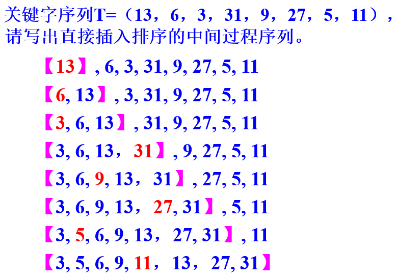{:width=150 height=150}
时间复杂度为O(n^2^)，空间复杂度为O(1)，是稳定的
###### 折半插入排序
子表有序且为顺序存储结构，则插入时采用折半查找可加速。
比较次数大大减少，全部元素比较次数仅为O(nlog~2~n)。
但移动次数不减少，时间复杂度仍为O(n^2^)，空间复杂度为O(1)，是稳定的
###### 2路插入排序
是对折半插入排序的一种改进，其目的是减少排序过程中的移动次数。
将r[1]赋值给d[1]：以它为中值，排序过程中形成两个有序部分--前半部分序列的值都小于该值,后半部分序列的值都大于该值
设first指针指示小于d[1]的有序序列中最小的记录；final指针指示大于d[1]的有序序列中最大的记录
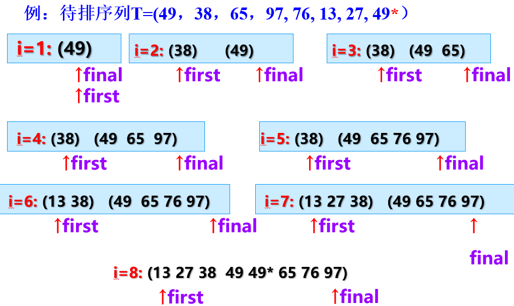{:width=150 height=150}
###### 希尔（shell）排序
又称缩小增量排序
基本思想：先**将整个待排记录序列分割成若干子序列**,分别进行直接插入排序。待整个序列中的记录“基本有序”时，再对全体记录进行一次直接插入排序。
子序列的构成不是简单地“逐段分割”，而是**将相隔某个增量dk的记录组成一个子序列**，让增量dk逐趟缩短（例如依次取5,3,1），直到dk=1为止。
优点：让关键字值小的元素能很快前移，且序列若基本有序时，再用直接插入排序处理，时间效率会高很多。
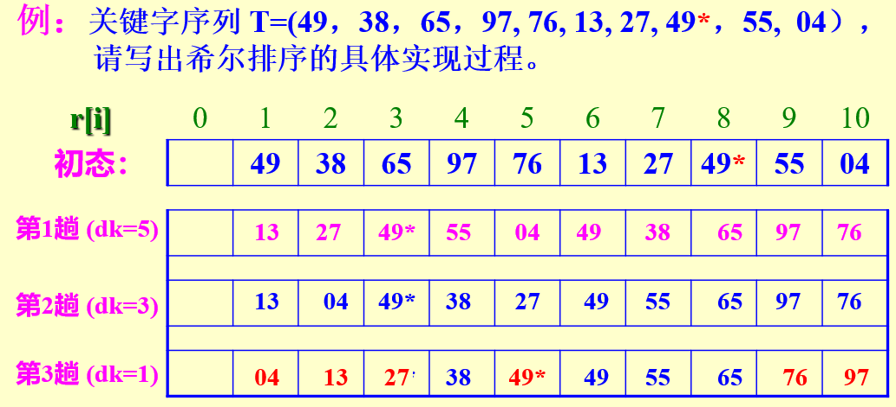{:width=150 height=150}
- dk=5：让索引为5k（5的倍数）的所有元素排序，再让5k+1的所有元素排序，...直至排完
- dk=3：让索引为3k的所有元素排序，...
- dk=1：相邻元素两两比较，得到最终结果

开始时dk的值较大，子序列中的对象较少，排序速度较快；随着排序进展，dk值逐渐变小，子序列中对象个数逐渐变多，由于前面工作的基础，大多数对象已基本有序，所以排序速度仍然很快。
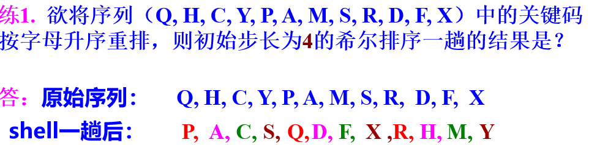{:width=100 height=100}
先找第1、5、9个元素，即`QPR`，它们排完的顺序是`PQR`，写到第1、5、9个位置；再找第2、6、10个元素，即`HAD`，它们排完的顺序是`ADH`，写到第2、6、10个位置；...
***
例2：`6 2 4 1 6* 9 5 8 7`
69 25 48 17 6*
dk=5：`6 2 4 1 6* 9 5 8 7`
615 26*8 497
dk=3：`1 2 4 5 6* 7 6 8 9`
dk=1：`1 2 4 5 6* 6 7 8 9`
时间效率：O(n^1.25^)~O(1.6n^1.25^)--由经验公式得到，适用于基本有序的序列排序
空间效率：O(1)--因为仅占用1个缓冲单元
算法的稳定性：不稳定
##### 交换排序
基本思想：两两比较待排序记录的关键码，如果发生逆序（即排列顺序与排序后的次序正好相反），则交换之，直到所有记录都排好序为止。
###### 冒泡排序
基本思路：每趟不断将记录两两比较，并按“前小后大”（或“前大后小”）规则交换。
优点：每趟结束时，不仅能挤出一个最大值到最后面位置，还能**同时部分理顺其他元素**；一旦下趟没有交换发生，还**可以提前结束排序**。
前提：顺序存储结构 
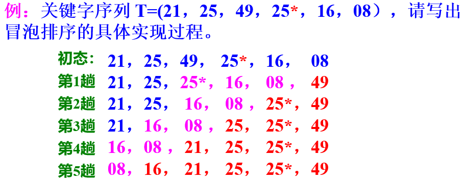{:width=100 height=100}
时间复杂度为O(n^2^)，空间复杂度为O(1)，是稳定的
###### 快速排序
基本思想：从待排序列中任取一个元素 (例如取第一个) 作为**中心**，所有**比它小的元素一律前放**，所有**比它大的元素一律后放**，形成**左右两个子表**；然后再对各子表重新选择中心元素并依此规则调整，直到每个子表的元素只剩一个。此时便为有序序列了。
优点：每趟可以确定不止一个元素的位置（呈指数增加）
前提：顺序存储结构 
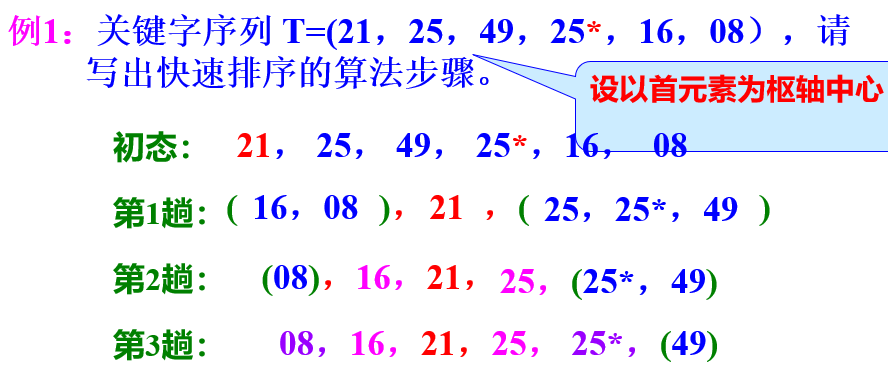{:width=100 height=100}
其中第1趟中21为中心，第2趟中16和25为中心，第3趟中08和25*为中心
***
例2：`6 2 4 1 6* 9 5 8 7`
第1趟：以首元素6为中心，从右往左找一个比它小的数和它交换位置，此例中为`5`，此时序列为`5 2 4 1 6* 9 6 8 7`；再从左往右找一个比它大的数和它交换位置，此例中为`9`，此时序列为`5 2 4 1 6* 6 9 8 7`。由此分成了`[5 2 4 1 6*]` `6` `[9 8 7]`两个子列，重复该过程，直到左子列的元素都≤6，右子列元素都≥6，此例中无需再重复
第2趟：
- 对`[5 2 4 1 6*]`：以首元素5为中心，从右往左找一个比它小的数和它交换位置，此例中为`1`，此时序列为`[1 2 4 5 6*]`；再从左往右找一个比它大的数和它交换位置，此例没有这样的数，由此分成了`[1 2 4]` `5` `[6*]`两个子列
- 对`[9 8 7]`：以首元素9为中心，从右往左找一个比它小的数和它交换位置，此例中为`7`，此时序列为`7 8 9`；再从左往右找一个比它大的数和它交换位置，此例没有这样的数，由此分成了`[7 8] 9`1个子列
- 结果为：`[1 2 4] 5 [6*] [7 8] 9`

第3趟：
- 对`[1 2 4]`：以首元素1为中心，从右往左找一个比它小的数和它交换位置，此例没有这样的数；再从左往右找一个比它大的数和它交换位置，此例没有这样的数。由此分成了`1 [2 4]`1个子列
- 对`[7 8]`：同理可知序列不变
- 结果为`1 [2 4] 5 6* 6 7 8 9`
第4趟：排序序列`[2 4]`，最终结果为`1 2 4 5 6* 6 7 8 9`
***
例3：`6 8 4 1 6* 9 5 2 7`
第1趟：以首元素6为中心，从右往左找一个比它小的数和它交换位置，此例中为`2`，此时序列为`2 8 4 1 6* 9 5 6 7`；再从左往右找一个比它大的数和它交换位置，此例中为`8`，此时序列为`2 6 4 1 6* 9 5 8 7`。由此分成了`[2]` `6` `[4 1 6* 9 5 8 7]`两个子列。
看到右子列中有≤6的元素，重复该过程--以首元素6为中心，从右往左找一个比它小的数和它交换位置，此例中为`5`，此时序列为`2 5 4 1 6* 9 6 8 7`；再从左往右找一个比它大的数和它交换位置，此例中为`9`，此时序列为`2 5 4 1 6* 6 9 8 7`。由此分成了`[2 5 4 1 6*]` `6` `[9 8 7]`两个子列。
***
https://blog.csdn.net/qq_37084904/article/details/119852074
时间效率：O(nlog~2~n)--因为每趟确定的元素呈指数增加
空间效率：O(log~2~n)--因为递归要用栈
稳定性：不稳定--因为有跳跃式交换
##### 选择排序
基本思想：每一趟在后面n-i个待排记录中选取关键字最小的记录作为有序序列中的第i个记录。
###### 简单选择排序
每经过一趟比较就找出一个最小值，与待排序列最前面的位置互换即可。
每趟只能确定一个元素，表长为n时需要n-1趟
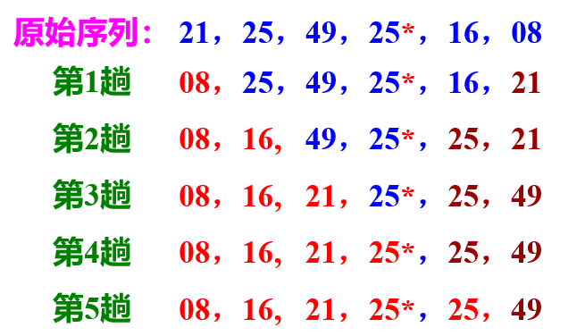{:width=100 height=100}
其中蓝色为待排序序列
时间效率：O(n^2^)移动次数较少，比较次数较多
空间效率：O(1)--没有附加单元（仅用到1个temp）
算法的稳定性：不稳定
###### 锦标赛排序（树形选择排序）
首先对n个记录的关键字进行两两比较，得到[n/2]个优胜者(关键字小者)，作为第一步比较的结果保留下来。然后在这[n/2]个较小者之间再进行两两比较，...，如此重复，直到选出最小关键字的记录为止。
例：关键字序列T=（21，25，49，25*，16，08，63）
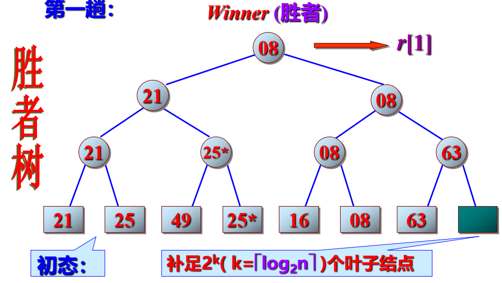{:width=150 height=150}
之后把08节点删去，让16上去再进行比较
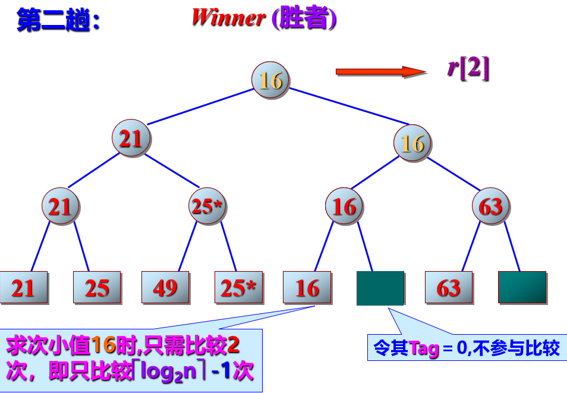{:width=150 height=150}
以此类推，直至树空
锦标赛排序构成的树是完全二叉树，其深度为[log~2~n]+1，其中n为待排序元素个数。
时间复杂度：O(nlog~2~n)--n个记录各自比较约log~2~n次
空间效率：O(n)--胜者树的附加内结点共有n~0~-1个
稳定性：稳定--可事先约定左结点“小”
###### 堆排序
最大/小堆：树中所有结点的值均大于（或小于）其左右孩子，此树的根结点（即堆顶）必最大（或最小）。
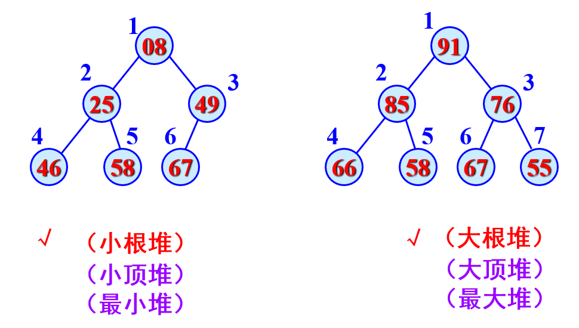{:width=150 height=150}
先根据数列建最大堆，之后输出（删除）根节点（最大值），之后对堆重新排列成最大堆，再输出根节点，直至堆空
时间效率：O(nlog~2~n)。因为整个排序过程中需要调用n-1次堆删除算法，而算法本身耗时为log~2~n；
空间效率：O(1)。没有额外开空间，仅在第二个for循环中交换记录时用到一个临时变量temp。
稳定性：不稳定。
优点：对小文件效果不明显，但对大文件有效。
##### 归并排序
基本思想：将两个（或以上）的有序表组成新的有序表。
可以把一个长度为n的无序序列看成是n个长度为1的有序子序列 ，首先做两两归并，得到`n/2`个长度为2的有序子序列 ；再做两两归并，...，如此重复，直到最后得到一个长度为n的有序序列。
例：关键字序列T=（21，25，49，25*，93，62，72，08，37，16，54）
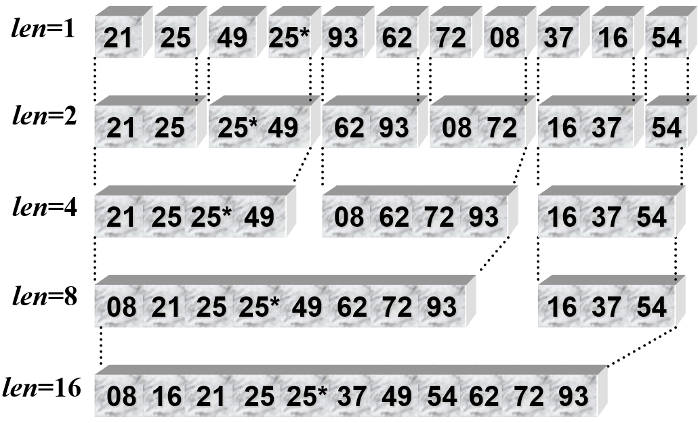{:width=150 height=150}
整个归并排序仅需[log~2~n]趟，但每趟仍要比较和整理n个元素
时间效率： O(nlog~2~n)
空间效率： O(n)--需要一个与原始序列同样大小的辅助序列
稳定性：稳定
##### 基数排序
基本思想：借助多关键字排序的思想对单逻辑关键字进行排序。即：用关键字不同的位值进行排序。
例：关键字序列T=（614，738，921，485，637， 101，215，530，790，306）
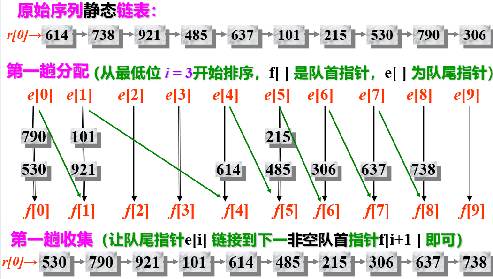{:width=150 height=150}
第一趟分配就是按个位数大小，将各个数分到不同的组（e[i]-f[i]）中
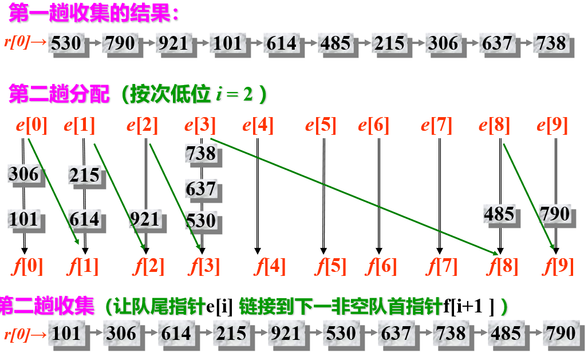{:width=150 height=150}
第二趟是按十位数
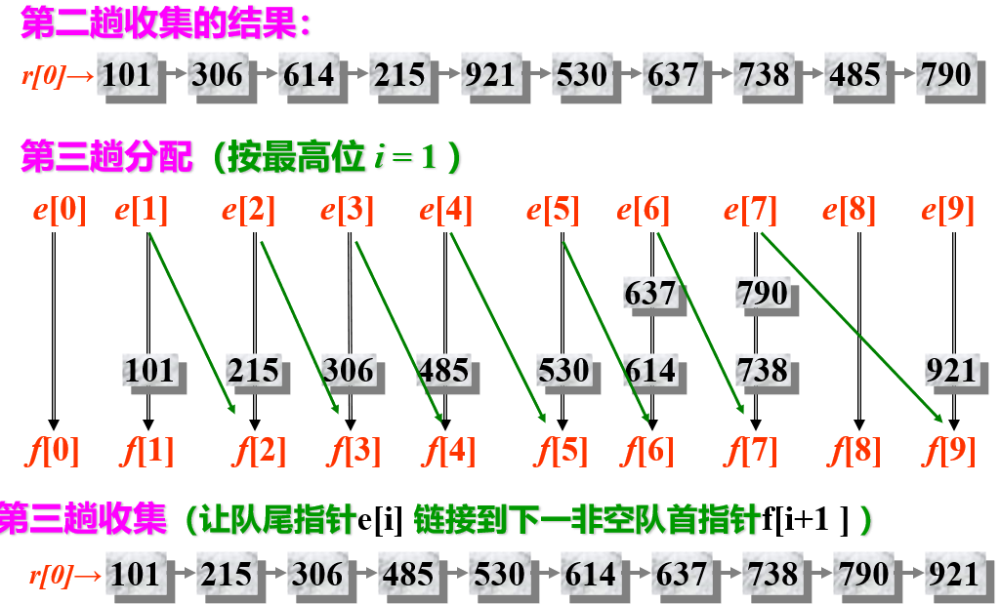{:width=150 height=150}
第三趟是按百位数
假设有n个记录, 每个记录的关键字有d位，每个关键字的取值有radix个，则：
- 时间复杂度为：O(d*(n+radix))--每趟总时间为O(n+radix)，全部排序需要重复进行d趟“分配”与“收集”
- 空间复杂度：O(n+radix)--需要增加n+2radix个附加链接指针，空间效率低
- 稳定性：稳定--一直前后有序

若基数radix相同，对于记录个数较多而关键码位数较少的情况，使用链式基数排序较好。
##### 总结
当待排序的关键字序列已经基本有序时，用直接插入排序最快。
当在n个数据（n很大）中选出最小的5-8个数据时，锦标赛排序最快。
当待排序关键字序列已经基本有序时，快速排序显著变慢。
归并排序对待排序关键字的初始排列不敏感，故排序速度较稳定。

循环队列实现--取模 栈与队列B--P19
KMP算法  串B--P10  有多少次比较
串B--P15  求NEXT数组/根据next数组反推原序列（只由2个字符组成并给定第一个字符） 
ababaabab
011234234 (第k位是第1至k-1位序列的最长相等前后缀长度+1)
数组地址 数组与广义表A--P6
三元组矩阵 数组与广义表A--P17
改进：带辅助向量的三元组 数组与广义表A--P20
第i行第j列的时间复杂度：取决于这行非0元素个数
稀疏矩阵的转置 数组与广义表B--P2/7
树的性质 树与二叉树A--P12-14
树与二叉树的转换 树与二叉树A--P19
二叉树的性质 树与二叉树A--P23
满二叉树/完全二叉树定义
二叉树的顺序存储 树与二叉树A--P34 代码见顺序存储模板.c
二叉树递归算法--求深度、叶子节点个数、k层节点个数 见手机图片
由二叉树的前中序序列构建完整序列 树与二叉树B--P23-25
线索二叉树基本性质 见手机图片/树与二叉树B--P27
线索二叉树的生成 树与二叉树B--P32
树的遍历与二叉树的遍历关系 树与二叉树C--P13
哈夫曼树/编码构建并求WPL 树与二叉树C--P31/36
哈夫曼树性质 叶子节点比中间节点少一个？ 树与二叉树C--P37
图的深度/广度遍历 图B--P5/8/14
最小生成树及权值（两种算法） 图C--P12/20
最短路径 图C--P29
拓扑排序 图D--P3/6/7 有回路就不能拓扑排序
关键路径 图D--P13/17
二分查找 只对有序顺序表 查找A--P24
二叉排序树定义 查找A--P36
平衡二叉树构建 查找A--P79-80
哈希查找 线性探测法/链式以及平均查找长度 查找B--P16/19
插入排序 希尔排序 排序A--P18
快速排序（重点）和算法程序 排序B--P9/12-13
锦标赛排序 排序B--P20-26
堆排序（重点） 排序B--P30/40 如何建大根堆P33-37
归并/基数排序 排序C--P3/13

算法：
前中后序遍历
线性表/链表（逆置等等，上机题）

3个程序设计：写伪代码和思路
二叉树递归
线性表
链表