### 顺序表
结构体定义如下：
```
struct list 
{
	int data[MAXSIZE];
	int last_index; //data数组中最后一个元素的索引（从0开始）
};
```
##### 去除重复数据
设置两个指针：慢指针slow走在后面，快指针fast走在前面探路，找到一个不重复的元素就告诉slow并让slow前进一步。当fast指针遍历完整个数组nums后nums[0--slow]就是不重复元素
```
//对有序表去重，返回去重后的顺序表长度
int unique_list(list& data) 
{
	int n = data.last_index + 1; //要去重的数组长度
	int slow = 0, fast = 0;
	while (fast < n)
	{
		if (data.data[fast] != data.data[slow])
		{
			slow++;
			data.data[slow] = data.data[fast];
		}
		fast++;
	}
	data.last_index = slow;
	return slow + 1;
}
```
时间复杂度为O(n)，未开辟新空间，空间复杂度为O(1)
测试：
```
void test() 
{
	int arr[10] = { 2,2,3,3,4,5,5,10,25,25 };
	list l = unit_byArray(arr, 10);
	unique_list(l);
	foreach_list(l);
}
```
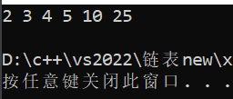
##### 去除0元素
设置两个指针：慢指针slow走在后面，快指针fast走在前面探路，找到一个不为0的元素就告诉slow并让slow前进一步。当fast指针遍历完整个数组nums后nums[0--slow]就是不为0的元素
```
//删除表中所有值为0的元素，返回新顺序表长度
int del_all_zero(list& data)
{
	int n = data.last_index + 1; //要处理的数组长度
	int slow = 0, fast = 0;
	while (fast < n)
	{
		if (data.data[fast] != 0)
		{
			data.data[slow] = data.data[fast];
			slow++;
		}
		fast++;
	}
	data.last_index = slow-1;
	return slow;
}
```
时间复杂度为O(n)，未开辟新空间，空间复杂度为O(1)
测试：
```
void test() 
{
	int arr[10] = { 0,2,6,5,5,2,4,0,0,0 };
	list l = unit_byArray(arr, 10);
	del_all_zero(l);
	foreach_list(l);
}
```
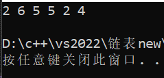
##### 排序
###### 冒泡排序
冒泡排序是一种简单的排序算法。它重复地遍历要排序的列表,一次比较两个元素,如果它们的顺序错误就把它们交换过来。遍历列表的工作是重复地进行直到没有再需要交换,也就是说该列表已经排序完成。
```
//冒泡排序（从小到大）
void bubble_sort(list& data)
{
	int n = data.last_index + 1; //要排序的数组长度
	for (int i = 0; i < n - 1; i++) //n-1是因为数组下标最大为n-1 要进行10轮比较
	{
		for (int j = 0; j < n-1-i; j++) //n-1是因为数组下标最大为n-1 要进行10次比较，再减i是因为每最后的i个元素已经有序不需要继续排序
		{
			if (data.data[j] > data.data[j+1]) //两两比较，将小的数据放前面
			{
				swap(data.data, j+1, j); //交换arr数组arr[j+1]和arr[j]的值
			}
		}
	}
}
```
时间复杂度均为O(n^2^)，未开辟新空间，空间复杂度为O(1)
测试：
```
void test() 
{
	int arr[10] = { 1,2,3,4,5,4,3,21,1 };
	list l = unit_byArray(arr, 10);
	bubble_sort(l);
	foreach_list(l);
}
```
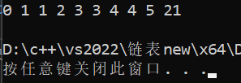
###### 选择排序
选择排序是一种简单直观的排序算法。它的工作原理是每次从待排序的数据元素中选出最小(或最大)的一个元素,存放在序列的起始位置,直到全部待排序的数据元素排完。
```
//选择排序（从小到大）
void select_sort(list& data)
{
	int n = data.last_index + 1; //要排序的数组长度
	int min; //用于存放最小值的下标
	for (int i = 0; i < n; i++)
	{
		min = i;//初始化选取假设的最小值,选取的是未排序序列的第一个数
		for (int j = i; j < n; j++)
		{
			if (data.data[j] < data.data[min])
				min = j;
		} //内循环退出，确定了最小值
		swap(data.data, i, min); //将最小值移动到已排序序列末尾
	}
}
```
时间复杂度均为O(n^2^)，未开辟新空间，空间复杂度为O(1)
测试：
```
void test() 
{
	int arr[10] = { 1,2,3,4,5,4,3,21,1 };
	list l = unit_byArray(arr, 10);
	select_sort(l);
	foreach_list(l);
}
```
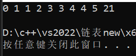
###### 插入排序
插入排序是一种简单直观的排序算法。它的工作原理是通过构建有序序列,对于未排序数据,在已排序序列中从后向前扫描,找到相应位置并插入。
```
//插入排序（从小到大）
void insert_sort(list& data)
{
	int n = data.last_index + 1; //要排序的数组长度
	int temp; //用于记录要插入的值
	for (int i = 1, j; i < n; i++)
	{
		temp = data.data[i]; //保存要插入的值
		for (j = i - 1; temp < data.data[j] && j >= 0; --j)  //数据往后移动，给要插入的值腾位
		{
			data.data[j + 1] = data.data[j];
		}
		data.data[j + 1] = temp;
	}
}
```
时间复杂度均为O(n^2^)，未开辟新空间，空间复杂度为O(1)
测试：
```
void test() 
{
	int arr[10] = { 1,2,3,4,5,4,3,21,1 };
	list l = unit_byArray(arr, 10);
	insert_sort(l);
	foreach_list(l);
}
```
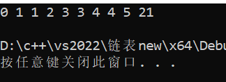
##### 模式匹配问题
KMP算法是一个常用的模式匹配算法。主要思想是当子串与目标字符串不匹配时,其已知这部分字符不需要再做比较,通过一个next数组,保存模式串中前后最长公共元素长度,可以将模式串向右滑动尽可能远的距离。
```
//KMP算法找子串，求next数组
void _get_next(hstring& h, int next[])
{
	int j = 0, k = -1;
	next[0] = -1;
	while (j < h.length - 1)
	{
		if (k == -1 || h.ch[j] == h.ch[k])
		{
			j++;
			k++;
			next[j] = k;
		}
		else
		{
			k = next[k];
		}
	}
}
//KMP算法找子串，返回子串第一次出现的位置，即在主串中的索引（从0开始）；若没找到就返回-1
int KMP_find_substring(hstring& str, hstring& substring)
{
	int len_str = str.length, len_sub = substring.length; //获取两个字符串的长度
	if (len_str == 0 || len_sub == 0 || len_str < len_sub)
	{
		printf("字符串长度为0或子串长度大于主串长度\n");
		return -1;
	}
	int* next = new int[substring.length];
	_get_next(substring, next);
	int i = 0, j = 0;
	while (i < len_str && j < len_sub)
	{
		if (j == -1 || str.ch[i] == substring.ch[j])
		{
			i++;
			j++;
		}
		else j = next[j]; //i不变，j后退
	}
	if (j >= len_sub) return i - len_sub;
	else return -1;
}
```
时间复杂度：O(m+n)，主字符串长m、子字符串长n
空间复杂度：O(n)
测试：
```
void test() 
{
	hstring str = create_hstring("abdcabc"),sub = create_hstring("abc");
	printf("%d", KMP_find_substring(str, sub));
}
```
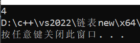
### 单链表
结构体定义如下：
```
struct link_nods
{
	int data;
	struct link_nods* next;
};
```
##### 逆置
要将单链表逆置，而不改变节点地址，可以通过调整节点之间的链接来实现。首先创建一个新的头节点，然后遍历原链表，每次都将当前节点插入到新头节点的后面。这样，原链表的最后一个节点就会成为新链表的第一个节点，从而实现链表的逆置。
```
//头插法逆置链表
struct link_nods* reverse_byInsert(struct link_nods* head)
{
	if (head == NULL || head->next == NULL)
	{
		printf("no reverse needed");
		return head;
	}
	struct link_nods* p = head->next;
	struct link_nods* q = p->next;
	head->next = NULL;
	while (p != NULL)
	{
		p->next = head->next;
		head->next = p;
		p = q;
		if (q != NULL)
			q = q->next;
	}
	return head;
}
//三指针法逆置链表
struct link_nods* reverse_byPoint(struct link_nods* head)
{
	if (head == NULL || head->next == NULL)
	{
		printf("no reverse needed");
		return head;
	}
	struct link_nods* p = head->next;
	struct link_nods* q = p->next;
	struct link_nods* r = q->next;
	p->next = NULL;
	while (r != NULL)
	{
		q->next = p;
		p = q;
		q = r;
		r = r->next;
	}
	q->next = p;
	head->next = q;
	return head;
}
```
时间复杂度：O(n)
空间复杂度：O(1)
测试：
```
void test() 
{
	int arr[10] = { 1,2,3,4,5,4,3,21,1 };
	link_nods* head = create_linklist(arr, 10);
	foreach_linklist(head);
	foreach_linklist(reverse_byInsert(head));
	foreach_linklist(reverse_byPoint(head));
}
```
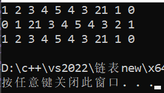
##### 找单链表中点
要找到单链表的中点，我们可以使用两个指针，一个快指针和一个慢指针。快指针每次移动两个节点，慢指针每次移动一个节点。当快指针到达链表的末尾时，慢指针将位于链表的中点。
```
//找单链表中点
//链表长度为奇数时，返回链表中间结点；为偶数时，返回中间两个节点中靠前的那一个，即返回节点和它的next都是中间节点
struct link_nods* find_mid(struct link_nods* head)
{
	struct link_nods* fast = head, * slow = head;
	while (fast != NULL && fast->next != NULL) 
	{
		fast = fast->next->next;
		slow = slow->next;
	}
	return slow;
}
```
时间复杂度：O(n)
空间复杂度：O(1)
测试：
```
void test() 
{
	int arr[10] = { 1,2,3,4,5,4,3,21,1 };
	link_nods* head = create_linklist(arr, 10);
	foreach_linklist(head);
	print_linknode(find_mid(head));
}
```
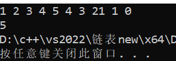
##### 找倒数第K个点
设置两个指针，让其中一个指针比另一个指针先前移k-1步，然后两个指针同时往前移动。循环直到先行的指针指为NULL时，另一个指针所指的位置就是所要找的位置
```
//找单链表倒数第k个点（k=1为最后一个节点，依此类推）
struct link_nods* find_byIndex_toLast(struct link_nods* head, int k)
{
	struct link_nods* fast = head, * slow = head;
	for (int i = 0; i < k; i++)
	{
		if (fast == NULL)
		{
			printf("不存在倒数第%d个点\n", k);
			return NULL;
		}
		fast = fast->next;
	}
	while (fast != NULL)
	{
		fast = fast->next;
		slow = slow->next;
	}
	return slow;
}
```
时间复杂度：O(n)
空间复杂度：O(1)
测试：
```
void test() 
{
	int arr[10] = { 1,2,3,4,5,4,3,21,1 };
	link_nods* head = create_linklist(arr, 10);
	foreach_linklist(head);
	print_linknode(find_byIndex_toLast(head,2));
}
```
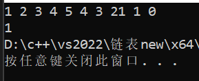
##### 删除倒数第K个点
先找到倒数第K个点，再删除它就可以了，可以使用已经写好的函数。
```
//删除单链表倒数第k个点（k=1为最后一个节点，依此类推）
struct link_nods* del_byIndex_toLast(struct link_nods* head, int k)
{
	struct link_nods* del_prev = find_byIndex_toLast(head, k + 1); //要删除节点之前的那个节点
	if (del_prev == NULL)
	{
		printf("无法删除倒数第%d个点\n", k);
		return head;
	}
	struct link_nods* del = del_prev->next; //要删除的那个节点
	del_prev->next = del->next; //将前节点与后节点相连
	free(del); //释放要删除的节点
	return head;
}
```
时间复杂度：O(n)
空间复杂度：O(1)
测试：
```
void test() 
{
	int arr[10] = { 1,2,3,4,5,4,3,21,1 };
	link_nods* head = create_linklist(arr, 10);
	foreach_linklist(head);
	del_byIndex_toLast(head, 3);
	foreach_linklist(head);
}
```
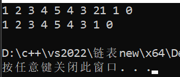
##### 判断是否有环
要判断单链表是否有环，我们可以使用两个指针，一个快指针和一个慢指针。快指针每次移动两个节点，慢指针每次移动一个节点。如果链表中存在环，那么快指针和慢指针最终会在环中的某个位置相遇。如果链表中存在环，我们可以通过以下方式找到环的交点：当快指针和慢指针第一次相遇时，我们将慢指针移动到链表的头部，然后将快指针和慢指针的速度都改为每次移动一个节点。当它们再次相遇时，相遇的位置就是环的交点。
```
//判断链表是否有环，若有则返回交点，没有则返回NULL
struct link_nods* find_circle(struct link_nods* head)
{
	struct link_nods* fast = head, * slow = head;
	while (fast != NULL && fast->next != NULL)
	{
		fast = fast->next->next;
		slow = slow->next;
		if (fast == slow) //链表中有环
		{
			fast = head;
			while (fast != slow)
			{
				fast = fast->next;
				slow = slow->next;
			}
			return fast;
		}
	}
	return NULL; //fast为空，无环
}
```
时间复杂度：O(n)
空间复杂度：O(1)
测试：
```
void test() 
{
	int arr[10] = { 1,2,3,4,5,4,3,21,1 };
	link_nods* head = create_linklist(arr, 10);
	create_circle(head, 5); //将值为5的节点设为环交点
	print_linknode(find_circle(head));
}
```
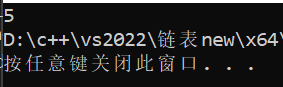
##### 判断是否相交
遍历两个链表，获取它们的长度；之后让较长的链表的指针先移动两个链表长度之差的步数.然后让两个链表的指针同时向前移动，当它们相遇时，相遇的位置就是交点。如果直到指针移动到了尾节点（为NULL时），就是没交点
```
//判断h1和h2有无交点，若有则返回交点，没有则返回NULL
struct link_nods* find_intersection(struct link_nods* h1, struct link_nods* h2)
{
	int len1 = get_linklist_length(h1), len2 = get_linklist_length(h2);
	struct link_nods* p1 = h1->next, *p2 = h2->next;
	if (len1 > len2)
	{
		for (int i = 0; i < len1 - len2; i++)
			p1 = p1->next;
	}
	else
	{
		for (int i = 0; i < len2 - len1; i++)
			p2 = p2->next;
	}
	while (p1 != NULL && p2 != NULL && p1 != p2)
	{
		p1 = p1->next;
		p2 = p2->next;
	}
	return p1;
}
```
时间复杂度：O(n)
空间复杂度：O(1)
测试：
```
void test() 
{
	int arr[10] = { 1,2,3,4,5,4,3,21,1 };
	link_nods* head1 = create_linklist(arr, 10);
	link_nods* head2 = create_linklist(arr, 10);
	create_intersection(head1, 2, head2, 3); //交点为head1链表索引为2的点
	print_linknode(find_intersection(head1, head2));
}
```
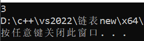
##### 删除重复节点
重复的结点保留一次：只需要判断当前节点和下一个节点值是否相同，如果相同那么当前节点的next就改为下一个节点的next。
重复的结点不保留：使用指针slow和fast遍历链表，初始时slow指向头结点，fast指向头结点的下一个结点。当fast指向的结点值与其后一个结点的结点值相同时，fast独自后移，直到它指向结点的结点值与其下一个结点的结点值不同为止。此时让slow指向结点的next指向last的后一个结点，让fast后移。有三种情况：
- 没有需要删除的重复结点，同时fast指向尾节点，此时slow->next==fast
- 有需要删除的重复结点，同时fast指向尾节点，此时链表后半段都需要删除，slow->next=fast
- 有需要删除的重复结点，fast未指向尾节点，此时链表中间某段需要删除，slow->next=fast
```
//去重，使每个元素只出现一次
struct link_nods* unique_linklist(struct link_nods* head)
{
	//只需要判断当前节点和下一个节点值是否相同，如果相同那么当前节点的next就改为下一个节点的next
	struct link_nods* p = head->next; //探测指针
	struct link_nods* del = NULL; //记录要删除的节点
	while (p != NULL && p->next != NULL)
	{
		if (p->data == p->next->data) //p节点与它的下一个节点值相等
		{
			del = p->next; //删除p的下一个节点
			p->next = p->next->next; //p的next指向要删除节点的下一个节点
			free(del);
		} //注意这里不能让p往后移，因为要删除节点的下一个节点的值还可能与p值相同，还要继续删
		else
		{
			p = p->next; //不相等就后移
		}
	}
	return head;
}
//删除链表中重复的结点，重复的结点不保留
struct link_nods* unique_linklist_thoroughly(struct link_nods* head)
{
	if (head == NULL || head->next == NULL) return head;
	struct link_nods* slow = head, * fast = slow->next;
	struct link_nods* del = NULL; 
	//记录要删除的节点
	while (fast != NULL && fast->next != NULL)
	{
		while (fast->next != NULL && fast->data != fast->next->data) 
		//未发现重复的节点，两个指针一起后移
		{
			fast = fast->next;
			slow = slow->next;
		}
		while (fast->next != NULL && fast->data == fast->next->data) 
		//发现重复的节点，fast独自后移
		{
			del = fast; //删除该节点
			fast = fast->next;
			free(del);
		}
		if (slow->next != fast) 
		//有需要删除的重复结点
		{
			slow->next = fast->next;
			free(fast); //删除重复节点
			if (slow == NULL) break; //是上面的情况2，直接退出即可
			fast = slow->next; //是上面的情况3，接着探测下一个节点
		}
	}
	return head;
}
```
时间复杂度：O(n)
空间复杂度：O(1)
测试：
```
void test() 
{
	int arr[10] = { 1,1,3,3,4,4,5,15,16,16 };
	link_nods* head1 = create_linklist(arr, 10);
	link_nods* head2 = create_linklist(arr, 10);
	foreach_linklist(head1);
	foreach_linklist(unique_linklist(head1));
	foreach_linklist(unique_linklist_thoroughly(head2));
}
```
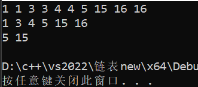
##### 约瑟夫问题
无损：首先创建一个循环链表来表示围成一圈的人。然后，我们创建一个新的链表来存储出列的顺序。每次我们跳过m-1个节点，然后将第m个节点添加到新的链表中。我们继续这个过程，直到只剩下一个节点。最后剩下的节点也添加到新的链表中。这样，我们就得到了一个新的链表，它表示了出列的顺序，而原链表中的所有数据都被保留了。
有损：首先创建一个循环链表来表示围成一圈的人。然后，我们使用两个指针prev和p来遍历链表。每次我们跳过m-1个节点，然后删除第m个节点。我们继续这个过程，直到只剩下一个节点。最后剩下的节点就是生存者。
```
//约瑟夫问题（无损）
//函数返回一个记录out顺序的链表
struct link_nods* josephus_noLoss(int n, int m)
{
	//先创建一个循环链表
	struct link_nods* head = create_empty_list(1); //循环链表的第一个节点，表示第一个人，值为1
	struct link_nods* p = head;
	for (int i = 2; i <= n; i++)
	{
		p->next = create_empty_list(i); //依次向循环链表中写入数据
		p = p->next;
	}
	p->next = head; //连接首尾节点，使成为循环链表

	//再创建一个单向链表用于记录out的顺序
	struct link_nods* order = create_empty_list();
	struct link_nods* order_p = order; //用于向order链表中添加元素

	//开始报数过程
	struct link_nods* prev = head;
	p = head; //p从第一个人开始移动
	while (p->next != p) //当圈中只有一个节点（一个人）时，p->next==p
	{
		for (int count = 1; count < m; count++)
		{
			prev = p;
			p = p->next;
		} //将p和prev移动m个节点，此时p指向的人out，prev指向out的人前面的节点
		order_p->next = p; //记录是第几个人出局，把出局的人（节点）移入记录链表中
		order_p = order_p->next; //移动记录链表的写入指针
		prev->next = p->next; //将out人前面的人与out人后面的人连接（跳过out的那个人）
		p = prev->next; //p指向out人后面的人，开始下一轮报数
	}
	order_p->next = p; //将最后剩的那个人写入order
	order_p->next->next = NULL; //将尾节点的next置空
	printf("剩下的是第%d个人\n", p->data);
	return order;
}
//约瑟夫问题（有损）
//函数返回最后那个人的序号，不保存out的人的顺序链表
int josephus(int n, int m)
{
	//先创建一个循环链表
	struct link_nods* head = create_empty_list(1); //循环链表的第一个节点，表示第一个人，值为1
	struct link_nods* p = head;
	for (int i = 2; i <= n; i++)
	{
		p->next = create_empty_list(i); //依次向循环链表中写入数据
		p = p->next;
	}
	p->next = head; //连接首尾节点，使成为循环链表

	//开始报数过程
	struct link_nods* prev = head;
	p = head; //p从第一个人开始移动
	while (p->next != p) //当圈中只有一个节点（一个人）时，p->next==p
	{
		for (int count = 1; count < m; count++)
		{
			prev = p;
			p = p->next;
		} //将p和prev移动m个节点，此时p指向的人out，prev指向out的人前面的节点
		prev->next = p->next; //将out人前面的人与out人后面的人连接（跳过out的那个人）
		free(p); //删除out的节点
		p = prev->next; //p指向out人后面的人，开始下一轮报数
	}
	int res = p->data;
	free(p);
	printf("剩下的是第%d个人\n", res);
	return res;
}
```
时间复杂度：O(n)
空间复杂度：O(n)
测试：
```
void test() 
{
	foreach_linklist(josephus_noLoss(10, 3));
	printf("%d", josephus(10, 3));
}
```
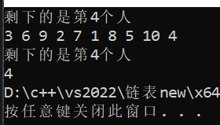
##### 合并两个升序单链表
本质上与数组的双指针法相同，都是用两个指针去分布探测两个链表，用另外一个指针更新结果链表的索引：pa和pb分别指向a和b的第一个数据，用它们对data大小进行探测；当pa和pb都不为空时，如果pb的数小，就先把pb加到结果中，反之把pa加到结果中。
```
//按递增顺序合并两个递增有序排列的链表（保留重复点）
struct link_nods* merge_linklist(struct link_nods* a, struct link_nods* b) 
{
	struct link_nods* pa = a->next, * pb = b->next; 
	struct link_nods* res_index = a;
	 //结果指针，用于记录添加到了哪（结果链表中已经添加了多少元素），它标注了节点添加的位置
	struct link_nods* temp = NULL; //用于待会添加结点时存储next
	while (pa && pb) //当pa和pb都不为空时
	{
		if (pa->data >= pb->data) //如果pb的数小，就先把pb加到结果中
		{
			temp = pb->next; //存储pb的下一个结点
			pb->next = NULL; //将pb从b链表中取出
			res_index->next = pb; //将pb添加为res_index的下一个节点
			res_index = res_index->next; //将结果指针后移，移到最新添加的节点pb上
			pb = temp; //将探测指针pb在b链上后移
		}
		else //如果pa的数小，就先把pa加到结果中
		{ //操作同上，只是把pb都换成pa
			temp = pa->next;
			pa->next = NULL;
			res_index->next = pa;
			res_index = res_index->next;
			pa = temp;
		}
	}
	res_index->next = (pa ? pa : pb); 
	//合并剩下的没遍历完的部分（若pa空了就接pb，若pa没空就是pb空了 接pb）
	return a;
}
```
时间复杂度：O(n)
空间复杂度：O(1)
测试：
```
void test() 
{
	int dz_arr1[6] = { 1,5,6,10,20,25 };
	int dz_arr2[7] = { 0,1,3,5,21,25,27 };
	link_nods* head1 = create_linklist(dz_arr1, 6);
	link_nods* head2 = create_linklist(dz_arr2, 7);
	foreach_linklist(merge_linklist(head1,head2));
}
```
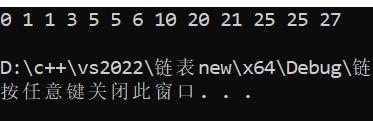
##### 合并两个升序单链表（降序）
只需将递增合并后的结果逆置即可。
```
//按递减顺序合并两个递增有序排列的链表（保留重复点）
struct link_nods* merge_reverse_linklist(struct link_nods* a, struct link_nods* b)
{
	return reverse_byInsert(merge_linklist(a, b)); //将递增合并后的结果逆置
}
```
时间复杂度：O(n)
空间复杂度：O(1)
测试：
```
void test() 
{
	int dz_arr1[6] = { 1,5,6,10,20,25 };
	int dz_arr2[7] = { 0,1,3,5,21,25,27 };
	link_nods* head1 = create_linklist(dz_arr1, 6);
	link_nods* head2 = create_linklist(dz_arr2, 7);
	foreach_linklist(merge_reverse_linklist(head1,head2));
}
```
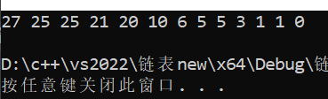
##### 判断是否对称
找到链表中点，将链表的后半部分反转；之后从头部和中点处同时开始遍历，若所有节点值都相等则对称。
```
//判断一个链表是否对称
bool is_palindrome(struct link_nods* head)
{
	if (head == NULL || head->next == NULL || head->next->next == NULL) return true; 
	//一个节点直接返回true
	if (head->next->next->next == NULL) return head->next->data == head->next->next->data; 
	//2个节点直接比较
	if (head->next->next->next->next == NULL) return head->next->data == head->next->next->next->data; 
	//3个节点直接比较
	struct link_nods* mid = find_mid(head); //找到链表中点
	reverse_byPoint(mid); //反转后半部分
	struct link_nods* p1 = head->next, *p2 = mid->next;
	while (p1 != mid->next && p2 != NULL)
	{
		if (p1->data != p2->data)
		{
			reverse_byPoint(mid); //复原链表
			return false;
		}
		p1 = p1->next;
		p2 = p2->next;
	}
	reverse_byPoint(mid); //复原链表
	return true;
}
```
时间复杂度：O(n)
空间复杂度：O(1)
测试：
```
void test() 
{
	int arr[9] = { 1,2,3,4,5,4,3,2,1 };
	link_nods* head = create_linklist(arr, 9);
	foreach_linklist(head);
	printf("%d", is_palindrome(head));
}
```
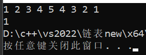