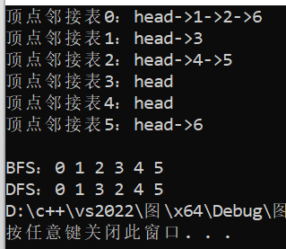
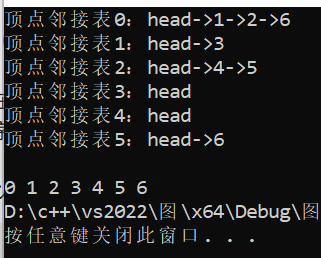

##### 图的遍历
基础结构：
```
#include<iostream>
#include<list>
#include<queue>
using std::list;
using std::queue;
using std::cout;
using std::endl;
using std::cin;
struct graph 
{
	int v; //顶点数
	list<int>* adj; //指向一个包含邻接表的数组的指针
public:
	graph(int);
	void add_edge(int, int); //添加边
	void print_graph();
	void BFS(int);
	void DFS(int, bool*);
};
//初始化顶点的数量和邻接列表
graph::graph(int v)
{
	this->v = v;
	adj = new list<int>[v];
}
//为图添加一条边
void graph::add_edge(int v, int w)
{
	adj[v].push_back(w);
}
//打印图的邻接列表
void graph::print_graph()
{
	for (int i = 0; i < v; ++i)
	{
		cout << "\n顶点邻接表" << i << "：head";
		for (auto x : adj[i])
			cout << "->" << x;
	}
}
```
###### BFS
广度优先遍历的过程可以类比树的层序遍历：
{:width=100 height=150}
***
代码实现：
```
//BFS
void graph::BFS(int s)
{
	bool* visited = new bool[v]; //记录顶点的访问状态
	for (int i = 0; i < v; i++)
		visited[i] = false; //初始状态都为经过
	queue<int> q;
	visited[s] = true; //将当前节点标记为已访问
	q.push(s); //放入队列
	while (!q.empty())
	{
		s = q.front();
		cout << s << " ";
		q.pop(); //将队列中第一个元素输出并出栈
		//得到已打印点s的所有邻接点，如果某个邻接点没被方法就标记它并让它入队
		for (auto i = adj[s].begin(); i != adj[s].end(); ++i)
		{
			if (!visited[*i])
			{
				q.push(*i);
				visited[*i] = true;
			}
		}
	}
}
```
借助一个辅助队列，v个顶点均需入队，空间复杂度为O(v)
邻接表形式存储时，每个顶点均需搜索一次，时间复杂度为O(v)。最坏的情况下，每个顶点至少访问一次，每条边至少访问1次，这是因为在搜索的过程中，若某结点向下搜索时，其子结点都访问过了，这时候就会回退，故时间复杂度为O(E)，算法总的时间复杂度为O(|V|+|E|)
###### DFS
{:width=100 height=100}
如上图所示，从2位置开始进行深度优先遍历，由于图可能是具有环形结构的，为了避免进入到环内的死循环，这里需要用到一个辅助数组visited来标记某一个顶点是否遍历过，如果遍历过的话，那么就不走这个方向，如果全部的方向都被标记遍历过，那就返回到上一个位置，换一个方向去遍历，即使用递归算法
对于visited数组，初始化为0，表示未访问过，如果访问了的话那么就设置为1 
最后整个图遍历完成之后，visited数组里面的数组全都为1 ，也就是说这个图已经遍历完成了
{:width=150 height=150}
***
代码实现：
```
//DFS
void graph::DFS(int s, bool* visited)
{
	visited[s] = true; //将当前节点标记为已访问
	cout << s << " "; //输出当前节点
	list<int>::iterator i;
	for (i = adj[s].begin(); i != adj[s].end(); i++)
		if (!visited[*i])
			DFS(*i, visited);
}
```
需要借助一个递归工作栈，故它的空间复杂度为O(V)
邻接表表示时，查找所有顶点的邻接点所需时间为O(E)，访问顶点的邻接点所花时间为O(V)，此时，总的时间复杂度为O(V+E)
测试：
```
int main()
{
	graph g(6);
	g.add_edge(0, 1);
	g.add_edge(0, 2);
	g.add_edge(1, 3);
	g.add_edge(2, 4);
	g.add_edge(5, 6);
	g.add_edge(0, 6);
	g.add_edge(2, 5);
	g.print_graph();
	cout << endl;
	g.BFS(0);
	cout << endl;
	bool* visited = (bool*)malloc(sizeof(bool) * g.v); //用于DFS的visited数组
	for (int i = 0; i < g.v; i++) visited[i] = false; //初始化为false
	g.DFS(0, visited);
	return 0;
}
```
测试结果：

##### 拓扑排序
拓扑排序通常用于解决“在给定的有向无环图(DAG)中，需要按照顶点的先后顺序进行排序”的问题。这种排序的一个常见应用是确定任务的依赖关系。
首先计算每个顶点的入度（即有多少边指向该顶点）。然后将所有入度为0的顶点添加到队列中。接着开始从队列中取出顶点，并将其输出。每取出一个顶点，就将其所有邻接顶点的入度减1，如果邻接顶点的入度变为0，就将其加入队列。这个过程一直持续到队列为空为止。
```
//拓扑排序
void graph::topo_sort()
{
	vector<int> in_degree(v + 1, 0);
	for (int u = 0; u < v; u++)
		for (auto i = adj[u].begin(); i != adj[u].end(); i++)
			in_degree[*i]++;
	queue<int> q;
	for (int i = 0; i < v; i++)
		if (in_degree[i] == 0)
			q.push(i);
	while (!q.empty())
	{
		int u = q.front();
		q.pop();
		cout << u << " ";
		for (auto i = adj[u].begin(); i != adj[u].end(); i++)
		{
			--in_degree[*i];
			if (in_degree[*i] == 0)
				q.push(*i);
		}
	}
}
```
时间和空间复杂度均为O(N)
测试：
```
int main()
{
	graph g(6);
	g.add_edge(0, 1);
	g.add_edge(0, 2);
	g.add_edge(1, 3);
	g.add_edge(2, 4);
	g.add_edge(5, 6);
	g.add_edge(0, 6);
	g.add_edge(2, 5);
	g.print_graph();
	cout << endl;
	g.topo_sort();
	return 0;
}	
```

##### 最小生成树和最短路径
**最小生成树**：在一个连通图中，所有的顶点都可以连通，并且所有的边的权值之和最小的树，称为最小生成树。常用的算法有Prim算法和Kruskal算法。
**Kruskal算法**：
- 设G=(V,E)是具有n个顶点的连通网，T=(U,TE)是其最小生成树。
- 初值U=V,TE={}。
- 对G中的边按权值大小从小到大依次选取。
- 选取权值最小的边，若边加入到TE后形成回路，则舍弃该边，否则将该边并入到TE中。
- 重复上面步骤，直到TE中包含n-1条边。

{:width=200 height=300}
当一条边加入到TE的集合后，**如何判断是否构成回路**：定义一个一维数组Vset[n]，存放图T中每个顶点所在的连通分量的编号。
- 初值：Vset[i] = i，表示每个顶点各自组成一个连通分量，连通分量的编号简单地使用顶点在图中的位置(编号)。

当往T中增加一条边时，先检查Vset[i]和Vset[j]的值：
- 若Vset[i] = Vset[j]：表明和处在同一个连通分量中，加入此边会形成回路；
- 若Vset[i] ≠ Vset[j]，则加入此边不会形成回路，将此边加入到生成树的边集中。

加入一条新边后，将两个不同的连通分量合并：将一个连通分量的编号换成另一个连通分量的编号。
```
MSTEdge *Kruskal_MST(MGraph *G){
    MSTEdge *TE;
    int *Vset = (int *) malloc(G->verxtexNum * sizeof(int));//Vset数组
    for (int i = 0; i < G->verxtexNum; i++) {
        Vset[i] = i;//初始化数组Vset[n]
    }
    MSTEdge * edgelist = getEdgeList(G);
    sort(edgelist);//对表权值按从小到大排序
    int j = 0, k = 0, s1, s2;
    while (j < G->arcNum && k < G->verxtexNum - 1) {
        s1 = Vset[edgelist[j].vex1];
        s2 = Vset[edgelist[j].vex2];
        if (s1 != s2) {//若边的两个顶点的连通分量编号不同，边加入到TE中
            TE[k].vex1 = edgelist[j].vex1;
            TE[k].vex2 = edgelist[j].vex2;
            TE[k].weight = edgelist[j].weight;
            k++;
            for (int i = 0; i < G->verxtexNum; i++) {
                if(Vset[i] == s2) {
                    Vset[i] = s1;//把连通分量改为较小的那一个
                }
            }
        }
        j++;
    }
    free(Vset);
    return TE;
}
```
时间复杂度为O(n^2^)，空间复杂度为O(n)
***
**最短路径**：在一个图中，从一个顶点到另一个顶点的所有路径中，边的权值之和最小的路径，称为最短路径。常用的算法有Dijkstra算法和Floyd算法。
**Dijkstra算法**：从图中的给定源点到其它各个顶点之间客观上应存在一条最短路径，从这组最短路径中，按其长度的递增次序，依次求出到不同顶点的最短路径和路径长度。即按长度递增的次序生成各顶点的最短路径，即先求出长度最小的一条最短路径，然后求出长度第二小的最短路径，以此类推，直到求出长度最长的最短路径。
**如何存放最短路径长度**：用一维数组dist[j]存储，源点默认，dist[j]表示到的路径长度。
**如何存放最短路径**：从源点到其它顶点的最短路径有n-1条，一条最短路径用一个一维数组表示，如从顶点0到5的最短路径为为0、2、3、5，表示为path[5]={0,2,3,5}，所有n-1条最短路径可以用二维数组path[][]存储。
```
void dijkstraPath(MGraph *G, int v) {  //从图G中的顶点v出发到其余各顶点的最短路径
    int m,min;
    for (int i = 0; i < G->verxtexNum; i++) {//各数组的初始化
        path[i] = v;
        final[i] = FALSE;
        dist[i] = G->edges[v][i];
    }
    //设置S={v}
    dist[v] = 0;
    final[v] = TRUE;
    for (int i = 0; i < G->verxtexNum - 1; i++) {//其余n-1个顶点
        while(final[m] == TRUE) {//找不在S中的顶点
            m++;
        }
        min = INFINITY;
        for (int i = 0; i < G->verxtexNum; i++) {//求出当前最小的dist[i]值
            if (final[i] == FALSE && dist[m] < min) {
                min = dist[m];
                m = i;
            }
        }
        final[m] = TRUE;
        for (int i = 0; i < G->verxtexNum; i++) {//修改dist和path数组的值
            if (final[i] == FALSE && dist[m] + G->edges[m][i] < dist[i]) {
                dist[i] = dist[m] + G->edges[m][i];
                path[i] = m;
            }
        }
    }
}
```
时间复杂度为O(n^2^)，空间复杂度为O(n)