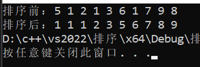

##### 希尔排序
希尔排序是一种基于插入排序的方法，通过比较相距一定间隔的元素来工作，各趟比较所用的距离随着算法的进行而减小，直到只比较相邻元素的最后一趟排序为止。
```
//希尔排序
void shell_sort(int a[], int n)
{
	for (int gap = n / 2; gap > 0; gap /= 2) //从大的间隔开始，然后缩小间隔
	{
		//第一个间隔a[0..gap-1]已经顺序排列
		//继续添加一个元素，直到对整个数组进行顺序排序
		for (int i = gap; i < n; i++) //将a[i]添加到已进行排序的元素中
		{ 
			int temp = a[i]; //用temp中保存a[i]，并在i处挖坑
			int j;
			for (j = i; j >= gap && a[j - gap] > temp; j -= gap)
				a[j] = a[j - gap]; //向上移动先前排序的元素，直到找到a[i]的正确位置
			a[j] = temp; //将temp（原来的a[i]）放在正确的位置
		} 
	}
}
```
时间复杂度：
- 最好情况：如果原始数组已经基本有序，那么时间复杂度可以达到O(n)。
- 最坏情况：时间复杂度为O(n^2^)。
- 平均情况：时间复杂度为O(n^1.3^)。

空间复杂度：希尔排序是一种原地排序算法，不需要额外的存储空间，所以其空间复杂度为O(1)。
***
测试：
```
int main()
{
	int a[10] = { 4,1,2,4,5,6,3,7,9,8 };
	printf("排序前：");
	show_array(a, 10);
	shell_sort(a, 10);
	printf("\n排序后：");
	show_array(a, 10);
}
```

##### 快速排序
先从数列中取出一个数作为基准数；将比这个数大的数全放到它的右边，小于或等于它的数全放到它的左边；再对左右区间重复第二步，直到各区间只有一个数
这里使用递归来做：
```
//在递归中使用的快速排序函数（从小到大）
void _quick_sort(int a[], int low, int high)
{
	if (low >= high)//递归终止条件：尾索引>=头索引
	{
		return;
	}
	int first = low, last = high;
	int key = a[first];//将first处的值放到key中
	int temp = first;//first即为坑位，之后last开始行动找值补坑
	while (first < last)
	{
		while (first < last && a[last] >= key)
		{
			--last;
		}//从右往左找一个比key小的值
		a[temp] = a[last];//将这个值放入坑位
		temp = last;//并将此处置为新坑
		while (first < last && a[first] <= key)//first开始行动找值补坑
		{
			++first;
		}//从左往右找一个比key要大的值
		a[temp] = a[first];//将这个值放入坑位
		temp = first;//并将此处置为新坑
	}
	a[temp] = key;//当first与last相遇的时候，将key放入到坑位中
	_quick_sort(a, low, temp - 1); //进行[low, temp - 1], temp, [temp + 1, high] 的递归分治
	_quick_sort(a, temp + 1, high);
}
//快速排序（从小到大）
void quick_sort(int arr[], int n)
{
	_quick_sort(arr, 0, n - 1);
}
```
时间复杂度：
- 最好情况：当数据正好可以每次都均匀分配，即每次选取的基准都能将数据分为两个长度相等的子序列时，快速排序的时间复杂度为O(nlogn)。
- 最坏情况：当数据已经是有序的(正序或者逆序)，每次选取的基准只能将数据分为一个长度为n-1的子序列和一个长度为0的子序列，这样就形成了递归树最深的情况，此时的时间复杂度为O(n^2^)。
- 平均情况：时间复杂度为O(nlogn)。

空间复杂度：快速排序是一种原地排序算法，不需要额外的存储空间，所以其空间复杂度为O(1)。但是由于快速排序是递归实现的，需要使用递归栈，所以实际的空间复杂度为O(logn)，n是递归的深度。
***
测试：
```
int main()
{
	int a[10] = { 10,1,2,1,3,6,3,7,9,8 };
	printf("排序前：");
	show_array(a, 10);
	quick_sort(a, 10);
	printf("\n排序后：");
	show_array(a, 10);
}
```

##### 堆排序
堆排序是一种基于比较的排序方法，使用二叉堆的数据结构：
- 首先将待排序的数组构造成一个大根堆（每个结点的值都大于其左孩子和右孩子结点的值），此时整个数组的最大值就是堆结构的顶端
- 将顶端的数与末尾的数交换，此时末尾的数为最大值，剩余待排序数组个数为n-1
- 将剩余的n-1个数再构造成大根堆，再将顶端数与n-1位置的数交换，如此反复执行，便能得到有序数组
```
//堆排序中建堆
void _heapify(int a[], int n, int i)
{
	int max = i;
	int left = 2 * i + 1;
	int right = 2 * i + 2;
	if (left<n && a[left]>a[max]) max = left;
	if (right<n && a[right]>a[max]) max = right;
	if (max != i) {
		swap(a[i], a[max]);
		_heapify(a, n, max);
	}
}
//堆排序
void heap_sort(int a[], int n)
{
	for (int i = n / 2 - 1; i >= 0; i--)
		_heapify(a, n, i);
	for (int i = n - 1; i >= 0; i--)
	{
		swap(a[0], a[i]);
		_heapify(a, i, 0);
	}
}
```
时间复杂度：堆排序的时间复杂度在所有情况下都是O(nlogn)。这是因为堆排序算法首先需要构建一个堆，这个过程的时间复杂度是O(n)，然后需要对n个元素进行堆调整，每次调整的时间复杂度是O(logn)，所以总的时间复杂度是O(nlogn)。
空间复杂度：堆排序的空间复杂度是O(1)。这是因为堆排序是原地排序算法，不需要额外的存储空间。
***
测试：
```
int main()
{
	int a[10] = { 5,1,2,1,3,6,1,7,9,8 };
	printf("排序前：");
	show_array(a, 10);
	heap_sort(a, 10);
	printf("\n排序后：");
	show_array(a, 10);
}
```

##### 二分查找
是一种在有序数组中查找特定元素的搜索算法。搜索过程从数组的中间元素开始，如果中间元素正好是要查找的元素，则搜索过程结束；如果某一特定元素大于或者小于中间元素，则在数组大于或小于中间元素的那一半中查找，而且跟开始一样从中间元素开始比较。如果在某一步骤数组为空，则代表找不到。
```
//二分查找（不使用递归），在长度为length的有序（从小到大）数组a中找值val
int binary_search(int val, int* a, int length)
{
	int low = 0, high = length - 1, mid; //最小值、最大值和中间值的下标
	while (low <= high) //循环终止条件
	{
		mid = (low + high) / 2; //每次递归重新给mid赋值，改变中间值的下标
		if (a[mid] == val) //如果中间值等于目标值，说明查找成功，返回下标
		{
			return mid;
		}
		else if (a[mid] > val) //如果中间值大于目标值，说明目标值在左半边
		{
			high = mid - 1; //下一次循环的终点就是中间值前的位置
		}
		else //如果中间值小于目标值，说明目标值在右半边
		{
			low = mid + 1; //下一次循环的起点
		}
	}
	return -1; //循环结束后仍未找到
}
```
时间复杂度：二分查找每次都会将问题规模减半，因此其时间复杂度为O(logn)，其中n为数组的长度。这是因为每次查找都会将搜索范围缩小一半，直到找到目标元素或者搜索范围为空。
空间复杂度：在实现二分查找时，我们并没有使用额外的存储空间，因此空间复杂度为O(1)。如果使用递归实现二分查找，那么空间复杂度就是O(logn)，因为递归调用会在调用栈中占用空间。
***
测试：
```
int main()
{
	int a[10] = { 5,1,2,1,3,6,1,7,9,8 };
	heap_sort(a, 10);
	show_array(a, 10);
	printf("\n2的位置为%d\n", binary_search(2, a, 10));
	printf("4的位置为%d", binary_search(4, a, 10));
}
```

##### 平衡二叉树
AVL树是一种自平衡二叉搜索树，在AVL树中任何结点的两个子树的高度最多相差1。假设由于在二叉搜索树上插入结点而失去平衡，则需要进行调整（RR、LL、LR和RL旋转）以恢复此属性，如下图所示。
{:width=200 height=250}
```
typedef struct AVLNode* AVLTree;
struct AVLNode {
	int data;     // 存值 
	AVLTree left;  // 左子树 
	AVLTree right;  // 右子树 
	int height;  // 树高 
};
// 返回最大值 
int Max(int a, int b)
{
	return a > b ? a : b;
}
// 返回树高，空树返回-1 
int getHeight(AVLTree A)
{
	return A == NULL ? -1 : A->height;
}
// LL旋转：把B的右子树腾出来挂上A的左子树，再将A挂在B的右子树上，返回B作为当前子树的根
AVLTree LLRotation(AVLTree A)
{
	// 此时根节点是A 
	AVLTree B = A->left;  // B为A的左子树  
	A->left = B->right;  // B的右子树挂在A的左子树上 
	B->right = A;   // A挂在B的右子树上 
	A->height = Max(getHeight(A->left), getHeight(A->right)) + 1;
	B->height = Max(getHeight(B->left), A->height) + 1;
	return B;  // 此时B为根结点 
}
// RR旋转：把B的左子树腾出来挂到A的右子树上，再将A挂在B的左子树上，返回B作为当前子树的根
AVLTree RRRotation(AVLTree A)
{
	// 此时根节点是A 
	AVLTree B = A->right;  // B为A的右子树
	A->right = B->left;   // B的左子树挂在A的右子树上
	B->left = A;   // A挂在B的左子树上
	A->height = Max(getHeight(A->left), getHeight(A->right)) + 1;
	B->height = Max(getHeight(B->left), A->height) + 1;
	return B;  // 此时B为根结点 
}
// LR旋转：先将B(A->left)作为根结点进行RR旋转，再将A作为根结点进行LL旋转
AVLTree LRRotation(AVLTree A)
{
	// 先RR旋转
	A->left = RRRotation(A->left);
	// 再LL旋转 
	return LLRotation(A);
}
// RL旋转：先将B(A->right)作为根结点进行LL旋转，再将A作为根结点进行RR旋转
AVLTree RLRotation(AVLTree A)
{
	// 先 LL 单旋
	A->right = LLRotation(A->right);
	// 再 RR 单旋 
	return RRRotation(A);
}
AVLTree Insert(AVLTree T, int x)
{
	if (!T)  // 如果该结点为空，初始化结点
	{
		T = (AVLTree)malloc(sizeof(struct AVLNode));
		T->data = x;
		T->left = NULL;
		T->right = NULL;
		T->height = 0;
	}
	else   // 否则不为空
	{
		if (x < T->data)  // 左子树
		{
			T->left = Insert(T->left, x);
			if (getHeight(T->left) - getHeight(T->right) == 2)   // 如果左子树和右子树高度差为 2 
			{
				if (x < T->left->data)  // LL旋转 
					T = LLRotation(T);
				else if (x > T->left->data)  // LR旋转
					T = LRRotation(T);
			}
		}
		else if (x > T->data)   // 右子树
		{
			T->right = Insert(T->right, x);
			if (getHeight(T->right) - getHeight(T->left) == 2)
			{
				if (x < T->right->data)  // RL旋转 
					T = RLRotation(T);
				else if (x > T->right->data)  // RR旋转
					T = RRRotation(T);
			}
		}
	}
	//更新树高 
	T->height = Max(getHeight(T->left), getHeight(T->right)) + 1;
	return T;
}
```
时间复杂度：由于AVL树始终保持平衡，所以插入、删除和查找操作的时间复杂度都是O(logn)。
空间复杂度：存储树需要O(n)的空间。
***
测试：
```
int main()
{
	AVLTree T = NULL;
	int n;
	cout << "请输入结点数：";
	cin >> n; //结点数
	for (int i = 0; i < n; i++)
	{
		int tmp;
		cin >> tmp;
		T = Insert(T, tmp);
	}
	cout << "\n根结点为：";
	cout << T->data << endl; 
	return 0;
}
```
输入上图中第2个树：

输入上图中第4个树：

##### 二叉搜索树
二叉搜索树：一棵二叉树，可以为空；如果不为空，满足以下性质：
- 非空左子树的所有键值小于其根结点的键值。
- 非空右子树的所有键值大于其根结点的键值。
- 左、右子树都是二叉搜索树

查找操作：
- 查找从根结点开始，如果树为空，返回NULL
- 若搜索树非空，则根结点关键字和X进行比较，并进行不同处理：
  - 若X小于根结点键值，只需在左子树中继续搜索；
  - 如果X大于根结点的键值，在右子树中进行继续搜索；
  - 若两者比较结果是相等，搜索完成，返回指向此结点的指针。
- 最大元素一定是在树的最右分枝的端结点上，最小元素一定是在树的最左分枝的端结点上。

在插入前，肯定要找到插入的位置。所以解决这个问题的关键就是要找到元素应该插入的位置，可以采用与Find类似的方法：
{:width=200 height=200}
删除：
- 叶结点--直接删除，修改其父结点指针，即置为NULL
- 只有一个孩子结点：将被删除的结点的父结点的指针指向被删除的结点的孩子结点
- 有左、右两棵子树：用被删除结点的右子树的最小元素或者左子树的最大元素替代被删除结点
{:width=200 height=200}

```
typedef int ElementType;
typedef struct TNode* Position;
typedef Position BinTree; /* 二叉树类型 */
struct TNode { /* 树结点定义 */
	ElementType Data; /* 结点数据 */
	BinTree Left;     /* 指向左子树 */
	BinTree Right;    /* 指向右子树 */
};
//查找
Position Find(ElementType X, BinTree BST)
{
	if (!BST) return NULL; /*查找失败*/
	if (X > BST->Data)
		return Find(X, BST->Right); /*在右子树中继续查找*/
	else if (X < BST->Data)
		return Find(X, BST->Left); /*在左子树中继续查找*/
	else /* X == BST->Data */
		return BST; /*查找成功，返回结点的找到结点的地址*/
}
//查找最小元素
Position FindMin(BinTree BST)
{
	if (!BST)
		return NULL; /*空的二叉搜索树，返回NULL*/
	else if (!BST->Left)
		return BST; /*找到最左叶结点并返回*/
	else
		return FindMin(BST->Left); /*沿左分支继续查找*/
}
//查找最大元素
Position FindMax(BinTree BST)
{
	if (BST)
		while (BST->Right)  /*沿右分支继续查找，直到最右叶结点*/
			BST = BST->Right;
	return BST;
}
//插入
BinTree Insert(BinTree BST, ElementType X)
{
	if (!BST) { /* 若原树为空，生成并返回一个结点的二叉搜索树 */
		BST = (BinTree)malloc(sizeof(struct TNode));
		BST->Data = X;
		BST->Left = BST->Right = NULL;
	}
	else { /* 开始找要插入元素的位置 */
		if (X < BST->Data)
			BST->Left = Insert(BST->Left, X);   /*递归插入左子树*/
		else  if (X > BST->Data)
			BST->Right = Insert(BST->Right, X); /*递归插入右子树*/
		/* else X已经存在，什么都不做 */
	}
	return BST;
}
//删除
BinTree Delete(BinTree BST, ElementType X)
{
	Position Tmp;
	if (!BST)
		printf("要删除的元素未找到");
	else {
		if (X < BST->Data)
			BST->Left = Delete(BST->Left, X);   /* 从左子树递归删除 */
		else if (X > BST->Data)
			BST->Right = Delete(BST->Right, X); /* 从右子树递归删除 */
		else
		{ /* BST就是要删除的结点 */
			/* 如果被删除结点有左右两个子结点 */
			if (BST->Left && BST->Right)
			{
				/* 从右子树中找最小的元素填充删除结点 */
				Tmp = FindMin(BST->Right);
				BST->Data = Tmp->Data;
				/* 从右子树中删除最小元素 */
				BST->Right = Delete(BST->Right, BST->Data);
			}
			else
			{ /* 被删除结点有一个或无子结点 */
				Tmp = BST;
				if (!BST->Left)       /* 只有右孩子或无子结点 */
					BST = BST->Right;
				else                   /* 只有左孩子 */
					BST = BST->Left;
				free(Tmp);
			}
		}
	}
	return BST;
}
void show_bst(BinTree t, int val)
{
	printf("\n最大元素为%d", FindMax(t)->Data);
	printf("\n最小元素为%d", FindMin(t)->Data);
	if (Find(val, t))
	{
		printf("\n找到了%d结点，它的左子结点为%d，右子结点为%d", val, Find(val, t)->Left->Data, Find(val, t)->Right->Data);
	}
	else
	{
		printf("\n未找到%d结点", val);
	}
}
```
时间复杂度：在最好的情况下(即树完全平衡)，插入、删除和查找操作的时间复杂度都是O(logn)，其中n是树中节点的数量。然而，在最坏的情况下(即树完全不平衡，变成了一个链表)，这些操作的时间复杂度都变成了O(n)。
空间复杂度：存储树需要O(n)的空间。
***
测试：（根据上面的两张图）
```
int main()
{
	BinTree tree = NULL;
	int n;
	cout << "请输入结点数：";
	cin >> n; //结点数
	for (int i = 0; i < n; i++)
	{
		int tmp;
		cin >> tmp;
		tree = Insert(tree, tmp);
	}
	show_bst(tree, 41); //查找41结点
	Delete(tree, 33); //删除33结点
	cout << endl;
	show_bst(tree, 41); //查找41结点
	return 0;
}
```

##### 哈希表
哈希表(Hash table，也叫散列表)，是根据关键码值(Key value)而直接进行访问的数据结构。也就是说，它通过把关键码值映射到表中一个位置来访问记录，以加快查找的速度。这个映射函数叫做散列函数，存放记录的数组叫做散列表。
```
#include<iostream>
#include<unordered_map>
using std::unordered_map;
using std::cout;
using std::endl;
using std::cin;
using std::string;
//向表中插入数据
void hash_insert(unordered_map<string,int> &hash_table)
{
	string key;
	int val;
	while (1)
	{
		cout << "请输入key：";
		cin >> key;
		if(hash_table.find(key) == hash_table.end()) //如果该key不存在就可以进行插入
			break; 
		else cout << key << "已存在" << endl;
	}
	cout << "请输入val：";
	cin >> val;
	hash_table[key] = val;
}
//删除key
void hash_delete(unordered_map<string, int>& hash_table, string key)
{
	if (hash_table.find(key) == hash_table.end())
	{
		cout << key << "不存在" << endl;
		return;
	}
	hash_table.erase(key);
}
//将key的值修改为val
void hash_change(unordered_map<string, int>& hash_table, string key, int val)
{
	if (hash_table.find(key) == hash_table.end())
	{
		cout << key << "不存在" << endl;
		return;
	}
	hash_table[key] = val;
}
//输出h中的数据
void hash_show(unordered_map<string, int>& hash_table)
{
	for(auto i:hash_table)
		cout << i.first << ":" << i.second << "       ";
	cout << endl;
}
```
时间复杂度：
- 插入元素：平均情况下，哈希表的插入操作是O(1)。但在最坏的情况下，如果所有的元素都哈希到同一个位置，那么插入操作的时间复杂度会退化到O(n)。
- 访问元素：哈希表的访问操作平均时间复杂度也是O(1)。同样，在最坏的情况下，如果所有的元素都哈希到同一个位置，那么访问操作的时间复杂度会退化到O(n)。
- 删除元素：哈希表的删除操作平均时间复杂度是O(1)。在最坏的情况下，删除操作的时间复杂度会退化到O(n)。

空间复杂度：哈希表的空间复杂度是O(n)，其中n是哈希表中元素的数量。
***
测试：
```
int main()
{
	unordered_map<string, int> h;
	for (int i = 0; i < 6; i++)
		hash_insert(h);
	hash_show(h);
	hash_delete(h, "a"); //删除a
	hash_change(h, "b", 200); //将b的值改为200
	hash_show(h);
	return 0;
}
```
