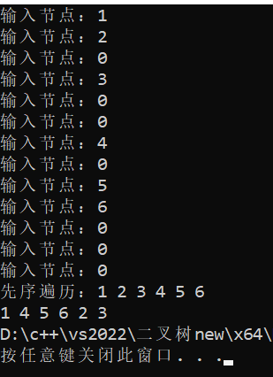
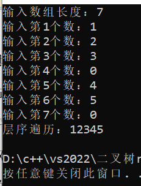

##### 建立二叉树并遍历
###### 链式存储
使用递归：
- 前序遍历：根结点 ---> 左子树 ---> 右子树
- 中序遍历：左子树 ---> 根结点 ---> 右子树
- 后序遍历：左子树 ---> 右子树 ---> 根结点
```
typedef struct node {
	int data;
	struct node* lchild, * rchild;
} node;
typedef node* bitree;
bitree buildtree()
{
    char c;
    node* p;
    printf("输入节点：");
    cin >> c;
    if (c == '0') return NULL;
    p = new(node);
    p->data = c;
    p->lchild = buildtree();
    p->rchild = buildtree();
    return(p);
}
//先序遍历
void DLR(bitree root)
{
    if (!root)return;
    printf("%c ", root->data);
    DLR(root->lchild);
    DLR(root->rchild);
}
//中序遍历
void LDR(bitree root)
{
    if (!root)return;
    LDR(root->lchild);
    printf("%c ", root->data);
    LDR(root->rchild);
}
//后序遍历
void LRD(bitree root)
{
    if (!root)return;
    LRD(root->lchild);
    LRD(root->rchild);
    printf("%c ", root->data);
}
```
空间与时间复杂度均为O(n)
测试：
```
void _test_traversal()
{
    bitree t;
    t = buildtree();
    printf("先序遍历：");
    DLR(t);
    printf("\n");
    printf("中序遍历：");
    LDR(t);
    printf("\n");
    printf("后序遍历：");
    LRD(t);
    printf("\n");
}
```

###### 顺序存储
```
//使用一个字符型数组来存储二叉树，其中第一个元素x[0]标识数组长度，根节点为x[1]
//空元素使用0进行占位，左子节点为x[2n]，右子节点为x[2n+1]

//先序遍历
void DLR_seq(char x[], int n)
{
    if (x[n] == '0' || n > x[0]) return;
    printf("%c ", x[n]);
    DLR_seq(x, 2 * n);
    DLR_seq(x, 2 * n + 1);
}
//中序遍历
void LDR_seq(char x[], int n)
{
    if (x[n] == '0' || n > x[0]) return;
    LDR_seq(x, 2 * n);
    printf("%c ", x[n]);
    LDR_seq(x, 2 * n + 1);
}
//后序遍历
void LRD_seq(char x[], int n)
{
    if (x[n] == '0' || n > x[0]) return;
    LRD_seq(x, 2 * n);
    LRD_seq(x, 2 * n + 1);
    printf("%c ", x[n]);
}
//层序遍历
void foreach_tree_seq(char x[], char seq = ' ')
{
    for (int i = 1; i <= x[0]; i++)
    {
        printf("%c%c", x[i], seq);
    }
    printf("\n");
}
```
先序、中序、后序空间与时间复杂度均为O(n)
测试：
```
void _test_seq()
{
    int len;
    printf("输入数组长度：");
    cin >> len; //13
    char* tree = new char[len + 1];
    tree[0] = len;
    for (int i = 1; i <= len; i++)
    {
        printf("输入第%d个数：", i);
        cin >> tree[i];
    }
    foreach_tree_seq(tree);

    printf("先序遍历：");
    DLR_seq(tree, 1);
    printf("\n");

    printf("中序遍历：");
    LDR_seq(tree, 1);
    printf("\n");

    printf("后序遍历：");
    LRD_seq(tree, 1);
    printf("\n");
}
```

##### 顺序存储与链式存储相互转换
利用递归，将链式存储中左右孩子与顺序存储相对应
```
//顺序转为链式存储
bitree order_to_chain(char x[], int index = 1)
{
    if (index > x[0] || x[index] == 0) return NULL;
    bitree root = new node;
    root->data = x[index] - '0';
    root->lchild = order_to_chain(x, 2 * index);
    root->rchild = order_to_chain(x, 2 * index + 1);
    return root;
}
//链式转为顺序存储
void chain_to_order(bitree t, char x[], int i = 1)
{
    if (t)
    {
        x[i] = char(t->data + '0');
        chain_to_order(t->lchild, x, 2 * i);
        chain_to_order(t->rchild, x, 2 * i + 1);
    }
    else x[i] = '0';
}
```
时间复杂度为O(N)，空间复杂度为O(n)
测试：
``` 
void test_seq()
{
    int len;
    printf("输入数组长度：");
    cin >> len; //13
    char* tree = new char[len + 1];
    tree[0] = len;
    for (int i = 1; i <= len; i++)
    {
        printf("输入第%d个数：", i);
        cin >> tree[i];
    }
    foreach_tree_seq(tree); //层序遍历顺序存储二叉树
    printf("\n");
    bitree t = order_to_chain(tree);
    level_traversal(t); //层序遍历链式存储二叉树
}
```

##### 求二叉树镜像
可以创建一个函数，该函数接收一个节点作为参数。如果该节点为空，我们直接返回。否则，我们交换该节点的左右子节点，然后递归地对左右子节点进行同样的操作。
```
//镜像
bitree mirror(bitree root)
{
    if (root == NULL) return NULL; //空树无需镜像
    bitree left = mirror(root->lchild); //将该结点的左子树镜像
    bitree right = mirror(root->rchild); //将该结点的将右子树镜像
    root->lchild = right;
    root->rchild = left; //交换该结点的左右子树
    return root;
}
//镜像
void mirror_seq(char x[], int index = 1)
{
    if (index >= x[0]) return;
    mirror_seq(x, 2 * index);
    mirror_seq(x, 2 * index + 1);
    swap(x[2 * index], x[2 * index + 1]); //交换左右节点的值
}
```
两种方法的时间和空间复杂度均为O(N)
测试：
```
void _test_traversal()
{
    bitree t;
    t = buildtree();
    printf("先序遍历：");
    DLR(t);
    printf("\n");
    mirror(t);
    DLR(t);
}
```

##### 求高度
递归地计算左子树和右子树的高度，然后返回较大的那个高度加一(当前节点的高度)。
```
//求高度
int get_depth(bitree root)
{
    if (root == NULL) return 0; //空树高度为0
    int left_depth = get_depth(root->lchild); //递归求左子树高度
    int right_depth = get_depth(root->rchild); //递归求右子树高度
    int depth = 1 + (left_depth > right_depth ? left_depth : right_depth); //树的高度是根到叶子最长路径上的结点的数量
    return depth;
}
```
时间和空间复杂度为O(N)
测试：
``` 
void _test_traversal()
{
    bitree t;
    t = buildtree();
    printf("先序遍历：");
    DLR(t);
    printf("\n");
    printf("树的高度为%d", get_depth(t));
}
```

***
```
//求深度
int get_depth_seq(char x[], int index = 1)
{
    if (index > x[0] || x[index] == 0) return 0;
    int left_depth = get_depth_seq(x, 2 * index);
    int right_depth = get_depth_seq(x, 2 * index + 1);
    return (left_depth > right_depth ? left_depth : right_depth) + 1;
}
```
时间和空间复杂度为O(N)
测试：
``` 
void test_seq()
{
    int len;
    printf("输入数组长度：");
    cin >> len; //13
    char* tree = new char[len + 1];
    tree[0] = len;
    for (int i = 1; i <= len; i++)
    {
        printf("输入第%d个数：", i);
        cin >> tree[i];
    }
    DLR_seq(tree);
    printf("\n");
    printf("树的深度为%d", get_depth_seq(tree));
}
```

##### 已知前序序列和中序序列构造二叉树
二叉树的先序序列遍历过程是：根→左→右。中序序列遍历过程是：左→根→右。
已知先序序列可以唯一确定根结点，即：先序序列的第一个结点就是根节点。确定完根结点之后，根据中序序列可以确定根结点的左子树和右子树，即：在中序序列中根结点的左边为根结点的左子树，根结点的右边为根结点的右子树。
```
//根据前序遍历序列和中序遍历序列还原二叉树
bitree PreInCreate(int* pre, int p_start, int p_end, int* in, int i_start, int i_end)
{
    if (p_start == p_end) return NULL;
    int root_val = pre[p_start];
    bitree root = new node;
    root->data = root_val;
    int i_root_index = 0;
    for (int i = i_start; i < i_end; i++)
    {
        if (root_val == in[i])
        {
            i_root_index = i;
            break;
        }
    }
    int left_num = i_root_index - i_start;
    root->lchild = PreInCreate(pre, p_start + 1, p_start + left_num + 1, in, i_start, i_root_index);
    root->rchild = PreInCreate(pre, p_start + left_num + 1, p_end, in, i_root_index + 1, i_end);
    return root;
}
```
时间复杂度为O(N)，空间复杂度为O(N)
测试：
``` 
void _test_traversal()
{
    int a[6] = { 1,2,3,4,5,6 }; //前序
    int b[6] = { 2,3,1,4,6,5 }; //中序
    LRD(PreInCreate(a, 0, 6, b, 0, 6));
}
```

***
顺序存储与链式存储构造思路与复杂度均相同，略
##### 层序遍历
可以使用队列的数据结构。首先，将根节点放入队列。然后，当队列不为空时，我们取出队列的第一个元素，访问它，然后将它的左右子节点放入队列。这样，我们就可以按层次从上到下，从左到右访问二叉树的所有节点。
```
//分层遍历二叉树
void level_traversal(bitree root)
{
    if (root == NULL) return;
    queue<bitree> q;
    q.push(root);
    while (!q.empty())
    {
        bitree node = q.front();
        q.pop();
        cout << node->data << " ";
        if (node->lchild != NULL) q.push(node->lchild);
        if (node->rchild != NULL) q.push(node->rchild);
    }
    cout << endl;
}
```
时间复杂度为O(N)，空间复杂度为O(N)
测试：
``` 
void test()
{
    bitree t;
    t = buildtree();
    printf("层序遍历：");
    level_traversal(t);
}
```

***
顺序存储二叉树中数组就是按层序遍历的顺序存储的，所以直接输出数组即可
```
//层序遍历
void level_traversal_seq(char x[])
{
    for (int i = 1; i <= x[0]; i++)
    {
        if (x[i] != '0')
            printf("%c", x[i]);
    }
    printf("\n");
}
```
时间复杂度为O(n)，空间复杂度为O(1)
测试：
``` 
void test_seq()
{
    int len;
    printf("输入数组长度：");
    cin >> len; 
    char* tree = new char[len + 1];
    tree[0] = len; 
    for (int i = 1; i <= len; i++)
    {
        printf("输入第%d个数：", i);
        cin >> tree[i];
    }
    printf("层序遍历：");
    level_traversal_seq(tree);
}
```

##### 求二叉树的宽度
可以使用层序遍历的方法。在每一层遍历开始前，我们记录队列的大小，即当前层的节点数。然后我们将这个节点数与我们之前记录的最大宽度进行比较，更新最大宽度。
```
//求二叉树的宽度
int get_width(bitree root)
{
    if (root == NULL) return 0; //检查根节点是否为空。如果为空，那么树的宽度就是0
    queue<bitree> q;
    q.push(root); //创建一个队列，并将根节点加入队列。
    int max_width = 0; //最大宽度
    while (!q.empty())
    {
        int level_size = q.size(); //记录当前队列的大小，即当前层的节点数
        max_width = max_width > level_size ? max_width : level_size; //更新maxWidth
        for (int i = 0; i < level_size; i++)
        {
            bitree node = q.front();
            q.pop();
            if (node->lchild != NULL) q.push(node->lchild);
            if (node->rchild != NULL) q.push(node->rchild);
        } //遍历当前层的所有节点，将它们的左右子节点加入队列
    } //当队列为空时，循环结束，此时的maxWidth就是树的最大宽度
    return max_width;
}
```
时间复杂度为O(N)，空间复杂度为O(N)
测试：
``` 
void test()
{
    bitree t;
    t = buildtree();
    printf("树的宽度为%d", get_width(t));
}
```

***
遍历每层，计算每层节点个数，再取最大值
```
//求宽度
int get_width_seq(char x[])
{
    int depth = get_depth_seq(x); //高度
    int max_width = 0; //最大每层节点数
    for (int i = 1; i <= depth; i++)
    {
        int width=0; //第i层结点数
        for (int j = pow(2, i - 1); j < pow(2, i); j++)
            if (x[j] != '0') width++;
        if (width > max_width) max_width = width; //更新最大结点数
    }
    return max_width;
}
```
时间复杂度为O(N)，空间复杂度为O(n)
测试：
``` 
void test_seq()
{
    int len;
    printf("输入数组长度：");
    cin >> len; //13
    char* tree = new char[len + 1];
    tree[0] = len;
    for (int i = 1; i <= len; i++)
    {
        printf("输入第%d个数：", i);
        cin >> tree[i];
    }
    foreach_tree_seq(tree);
    printf("\n");
    printf("树的宽度为%d", get_width_seq(tree));
}
```

##### 结点个数
使用递归的方法。对于任意一个节点，它的节点个数等于左子树的节点个数加上右子树的节点个数再加一(当前节点)。
```
//节点个数
int node_count(bitree root)
{
    if (root == NULL) return 0;
    return node_count(root->lchild) + node_count(root->rchild) + 1;
}
```
时间复杂度为O(N)，空间复杂度为O(N)
测试：
``` 
void test()
{
    bitree t;
    t = buildtree();
    printf("节点个数为%d", node_count(t));
}
```

***
遍历数组，统计非0值个数即节点个数
```
//节点个数
int get_node_num_seq(char x[])
{
    int count = 0;
    for (int i = 1; i <= x[0]; i++)
    {
        if (x[i] != '0') count++;
    }
    return count;
}
```
时间复杂度为O(N)，空间复杂度为O(1)
测试：
``` 
void test_seq()
{
    int len;
    printf("输入数组长度：");
    cin >> len;
    char* tree = new char[len + 1];
    tree[0] = len; 
    for (int i = 1; i <= len; i++)
    {
        printf("输入第%d个数：", i);
        cin >> tree[i];
    }
    foreach_tree_seq(tree);
    printf("树的节点数为%d", get_node_num_seq(tree));
}
```

##### k层节点个数
使用递归：k层节点的个数=根节点左子树的k-1层节点个数+根节点右子树的k-1层节点个数
```
//第k层节点数
int node_num_k(bitree root, int k)
{
    if (root == NULL) return 0; //空树直接返回0
    if (k == 1) return 1; //k==1即求根节点的个数，直接返回1
    return node_num_k(root->lchild, k - 1) + node_num_k(root->rchild, k - 1);
}
```
时间复杂度为O(N)，空间复杂度为O(N)
测试：
``` 
void test()
{
    bitree t;
    t = buildtree();
    printf("第2层节点个数为%d", node_num_k(t,2));
}
```

***
遍历第k层的元素，统计非0值个数即节点个数
```
//k层节点个数
int get_k_num_seq(char x[], int i)
{
    int count = 0;
    for (int j = pow(2, i - 1); j < pow(2, i); j++)
    {
        if (x[j] != '0') count++;
    }
    return count;
}
```
时间复杂度为O(N)，空间复杂度为O(1)
测试：
```
void test_seq()
{
    int len;
    printf("输入数组长度：");
    cin >> len; //
    char* tree = new char[len + 1];
    tree[0] = len; 
    for (int i = 1; i <= len; i++)
    {
        printf("输入第%d个数：", i);
        cin >> tree[i];
    }
    foreach_tree_seq(tree);
    printf("第2层节点数为%d", get_k_num_seq(tree,2));
}
```

##### 叶子结点的个数
没有左右子树即为叶子结点。使用递归：根节点叶子节点个数=根节点左子树叶子节点个数+根节点右子树叶子节点个数
```
//叶子节点数
int leaf_count(bitree root)
{
    if (root == NULL) return 0; //空树直接返回0
    if (root->lchild == NULL && root->rchild == NULL) return 1;
    return leaf_count(root->lchild) + leaf_count(root->rchild);
}
```
时间复杂度为O(N)，空间复杂度为O(N)
测试：
``` 
void test()
{
    bitree t;
    t = buildtree();
    printf("叶子节点个数为%d", leaf_count(t));
}
```

***
遍历数组，没有左右孩子的就是叶子节点
```
//叶子节点数
int get_leaf_num_seq(char x[])
{
    int count = 0;
    int size = x[0];
    for (int i = 1; i <= size; i++)
    {
        if (x[i] != '0' && (2 * i > size || x[2 * i] == '0') && (2 * i + 1 > size || x[2 * i + 1] == '0'))
            count++;
    }
    return count;
}
```
时间复杂度为O(N)，空间复杂度为O(1)
测试：
``` 
void test_seq()
{
    int len;
    printf("输入数组长度：");
    cin >> len; 
    char* tree = new char[len + 1];
    tree[0] = len; 
    for (int i = 1; i <= len; i++)
    {
        printf("输入第%d个数：", i);
        cin >> tree[i];
    }
    printf("叶子节点数为%d", get_leaf_num_seq(tree));
}
```

##### 判断是否结构相同
使用递归的方法。首先，如果两棵树都为空，那么它们的结构相同。如果只有一棵树为空，那么它们的结构不同。如果两棵树都不为空，需要递归地检查它们的左子树和右子树是否结构相同。
```
//判断两树结构是否相同
bool is_same(bitree t1, bitree t2)
{
    if (t1 == NULL && t2 == NULL) return true;
    else if (t1 == NULL || t2 == NULL) return false;
    else return is_same(t1->lchild, t2->lchild) && is_same(t1->rchild, t2->rchild);
}
```
时间复杂度为O(N)，空间复杂度为O(N)
测试：
``` 
void test()
{
    bitree t1;
    t1 = buildtree();
    printf("\n");
    bitree t2;
    t2 = buildtree();
    printf("%d", is_same(t1,t2));
}
```

***
依次比较数组的元素，有不同的元素（一个数组某处值为0，而另一个数组该处值不为0）就结构不同
```
//判断结构是否相同
bool is_same_seq(char x1[], char x2[])
{
    if (x1[0] != x2[0]) return false; //节点数不同，结构不同
    for (int i = 1; i <= x1[0]; i++)
    {
        if ((x1[i] != '0' && x2[i] == '0') || (x1[i] == '0' && x2[i] != '0'))
        {
            return false;
        }
    }
    return true;
}
```
时间复杂度为O(N)，空间复杂度为O(1)
测试：
``` 
void test_seq()
{
    int len;
    printf("输入数组长度：");
    cin >> len; //
    char* tree = new char[len + 1];
    tree[0] = len; 
    for (int i = 1; i <= len; i++)
    {
        printf("输入第%d个数：", i);
        cin >> tree[i];
    }
    printf("\n");
    int len1;
    printf("输入数组长度：");
    cin >> len1; //
    char* tree1 = new char[len1 + 1];
    tree1[0] = len1;
    for (int i = 1; i <= len1; i++)
    {
        printf("输入第%d个数：", i);
        cin >> tree1[i];
    }
    printf("\n");
    printf("%d", is_same_seq(tree, tree1));
}
```

##### 最低公共祖先结点
使用递归的方法：从根节点开始，如果当前节点是要找的节点之一，那么这个节点就是最低公共祖先。如果当前节点不是要找的节点，就在左子树和右子树中分别查找。如果左子树和右子树都找到了节点，那么当前节点就是最低公共祖先。如果只有左子树或者右子树找到了节点，那么最低公共祖先就在那个子树中。
```
//求两个节点的最低公共祖先结点
bitree common_ancestor(bitree root, bitree p, bitree q)
{
    if (root == NULL) return NULL;
    if (root == p || root == q) return root;
    bitree left = common_ancestor(root->lchild, p, q);
    bitree right = common_ancestor(root->rchild, p, q);
    //如果left和right都不空，意味着pq在不同的子树，结果为根节点
    if (left != NULL && right != NULL) return root;
    //如果只有left非空，意味着pq在相同的左子树
    if (left != NULL) return left;
    //如果只有right非空，意味着pq在相同的右子树
    if (right != NULL) return right;
    return NULL;
}
```
时间复杂度为O(N)，空间复杂度为O(N)
测试：
``` 
void test()
{
    bitree t;
    t = buildtree();
    printf("%d", common_ancestor(t,t->lchild->lchild,t->lchild->rchild)->data);
}
```

***
```
//求两个节点的最低公共祖先结点，返回它的索引
int common_ancestor_seq(char x[], int p, int q, int root = 1)
{
    if (root >= x[0] || x[root] == '0') return 0;
    if (root == p || root == q) return root;
    int left = common_ancestor_seq(x, p, q, 2 * root);
    int right = common_ancestor_seq(x, p, q, 2 * root + 1);
    //如果left和right都不空，意味着pq在不同的子树，结果为根节点
    if (left != 0 && right != 0) return root;
    //如果只有left非空，意味着pq在相同的左子树
    if (left != 0) return left;
    //如果只有right非空，意味着pq在相同的右子树
    if (right != 0) return right;
    return 0;
}
```
时间复杂度为O(N)，空间复杂度为O(N)
测试：
``` 
void test_seq()
{
    int len;
    printf("输入数组长度：");
    cin >> len; //
    char* tree = new char[len + 1];
    tree[0] = len; 
    for (int i = 1; i <= len; i++)
    {
        printf("输入第%d个数：", i);
        cin >> tree[i];
    }
    printf("\n");
    printf("最低公共祖先结点为%d", common_ancestor_seq(tree, 5, 6));
}
```

##### 非递归方法遍历二叉树
前序遍历：先遍历根节点，然后再遍历其左子树和右子树，这是一个层级，把其左子树或右子树再次当做一个独立的树去调用(每个节点被传入调用的时候，都当了一次根节点，所以才有机会被输出)，目的就是输出访问一遍。
中序遍历：遇到节点，先把它入栈，后面依次遍历它的左子树，若该节点的左子树为空，将其出栈，然后遍历该节点的右子树（遍历右子树的方法：先把它入栈，后面依次遍历它的左子树，若该节点的左子树为空，将其出栈，然后遍历该节点的右子树）。
后序遍历：在前序遍历的过程中，孩子入栈的顺序颠倒一下（先进左孩子，再进右孩子），再把出栈的元素放入另一个栈B。遍历完后，再将栈B元素出栈，即后序遍历。
```
//非递归方法前序遍历
void DLR2(bitree root)
{
    stack<bitree> s;
    s.push(root); //先将头节点入栈
    while (!s.empty()) //栈不为空则继续
    {
        bitree front = s.top();
        s.pop();
        printf("%d", front->data);
        if (front->rchild) s.push(front->rchild); //先将右孩子入栈
        if (front->lchild) s.push(front->lchild); //再将左孩子入栈
    }
}
//非递归方法中序遍历
void LDR2(bitree root)
{
    stack<bitree> s;
    bitree front = root;
    while (!s.empty() || front)
    {
        while (front)
        {
            s.push(front); //节点不为空，就入栈
            front = front->lchild; //找左孩子
        }
        if (!s.empty())
        {
            front = s.top(); //若该节点左孩子为空，将其出栈，后找该节点右孩子
            s.pop();
            printf("%d", front->data);
            front = front->rchild; //后以同样的方法遍历右孩子
        }
    }
}
//非递归方法后序遍历
void LRD2(bitree root)
{
    stack<bitree> s;
    stack<bitree> ss; //创建两个栈ps，pss
    s.push(root);
    while (!s.empty())
    {
        bitree front = s.top();
        s.pop();
        ss.push(front); //将出栈元素放入新的栈中
        if (front->lchild) s.push(front->lchild); //先将左孩子入栈
        if (front->rchild) s.push(front->rchild); //再将右孩子入栈
    }
    while (!ss.empty())
    {
        bitree front = ss.top();
        ss.pop();
        printf("%d", front->data);
    }
}
```
时间复杂度为O(N)，空间复杂度为O(N)
测试：
``` 
void test()
{
    bitree t;
    t = buildtree();
    printf("先序遍历：");
    DLR2(t);
    printf("\n");
    printf("中序遍历：");
    LDR2(t);
    printf("\n");
    printf("后序遍历：");
    LRD2(t);
    printf("\n");
}
```

***
思路与上面相同，这里使用栈来保存节点的索引
```
//非递归方法前序遍历
void DLR2_seq(char x[])
{
    stack<int> s;
    s.push(1); //先将头节点入栈
    while (!s.empty()) //栈不为空则继续
    {
        int front = s.top();
        s.pop();
        printf("%c", x[front]);
        if (2 * front + 1 <= x[0] && x[2 * front + 1] != '0') s.push(2 * front + 1); //先将右孩子入栈
        if (2 * front <= x[0] && x[2 * front] != '0') s.push(2 * front); //再将左孩子入栈
    }
}
//非递归方法中序遍历
void LDR2_seq(char x[])
{
    stack<int> s;
    int front = 1;
    while (!s.empty() || (front <= x[0] && x[front] != '0'))
    {
        while (front <= x[0] && x[front] != '0')
        {
            s.push(front); //节点不为空，就入栈
            front = 2 * front; //找左孩子
        }
        if (!s.empty())
        {
            front = s.top(); //若该节点左孩子为空，将其出栈，后找该节点右孩子
            s.pop();
            printf("%c", x[front]);
            front = 2 * front + 1; //后以同样的方法遍历右孩子
        }
    }
}
//非递归方法后序遍历
void LRD2_seq(char x[])
{
    stack<int> s;
    stack<int> ss; //创建两个栈ps，pss
    s.push(1);
    while (!s.empty())
    {
        int front = s.top();
        s.pop();
        ss.push(front); //将出栈元素放入新的栈中
        if (2 * front <= x[0] && x[2 * front] != '0') s.push(2 * front); //先将左孩子入栈
        if (2 * front + 1 <= x[0] && x[2 * front + 1] != '0') s.push(2 * front + 1); //再将右孩子入栈
    }
    while (!ss.empty())
    {
        int front = ss.top();
        ss.pop();
        printf("%c", x[front]);
    }
}
```
时间复杂度为O(N)，空间复杂度为O(N)
测试：
``` 
void test_seq()
{
    int len;
    printf("输入数组长度：");
    cin >> len; 
    char* tree = new char[len + 1];
    tree[0] = len; 
    for (int i = 1; i <= len; i++)
    {
        printf("输入第%d个数：", i);
        cin >> tree[i];
    }
    printf("先序遍历：");
    DLR2_seq(tree);
    printf("\n");
    printf("中序遍历：");
    LDR2_seq(tree);
    printf("\n");
    printf("后序遍历：");
    LRD2_seq(tree);
    printf("\n");
}
```
