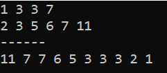

##### 2.6
{:width=400 height=400}
##### 2.7
{:width=400 height=400}
**a**:找到P的后继节点，P的next变为后继节点的next，之后释放该后继节点。
**b**:使用Q保存P，之后使用P从头遍历链表，找到P的前一个结点的前一个结点，让它的next指向它的next的next（也就是题中的P结点），并进行释放。
{:width=300 height=300}
**c**:与b类似，找到要删除结点的前一个结点，让它的next指向要删除结点的next，并进行释放。
**d**:让头节点的next指向首元结点的next，并释放首元结点。
**e**:找到倒数第二个结点P，让它的next为空，并释放最后一个结点Q。
##### 2.9
{:width=200 height=200}
{:width=350 height=350}
\---------------------------------------------------------------------------------------------------
{:width=180 height=180}
{:width=300 height=300}
{:width=450 height=450}
##### 2.19
链表定义如下（下同）：
```
struct link_nods
{
	int data;
	struct link_nods* next;
};
```
只需遍历头节点--data小于maxk的这部分节点，若节点的data>mink就删去，<=mink就保留。
{:width=450 height=450}
时间复杂度为`O(n)`
-------------------------------------------------
测试：
```
int main()
{
	int test[6] = { 1,5,6,10,20,25 };
	struct link_nods* h1 = create_linklist(test, 6);
	foreach_linklist(h1); //初始状态
	delete_val(h1, 5, 21); //删除表中大于5小于21的元素
	foreach_linklist(h1); //删除后
	return 0;
}
```
运行结果：
{:width=50 height=50}
##### 2.21
顺序表定义如下（下同）：
```
struct list 
{
	int data[MAXSIZE];
	int last_index; //data数组中最后一个元素的索引（从0开始）
};
```
思路：将表中最前和最后的元素依次交换
```
//将a数组中索引为n和m的两个数交换位置
void swap(int a[], int n, int m)
{
	int temp = a[n];
	a[n] = a[m];
	a[m] = temp;
}
//将l倒序
void reverse_list(list& l)
{
	for (int i = 0; i < (l.last_index + 1) / 2; i++)
	{
		swap(l.data, i, l.last_index - i);
	}
}
```
-------------------------------------------------
测试：
```
int main()
{
	int test_arr[10] = { 1,2,3,4,5,6,7,8,9,10 };
	list test = unit_byArray(test_arr, 10);
	foreach_list(test); //初始状态
	reverse_list(test);
	foreach_list(test); //倒序后
	printf("-----------------------\n");
	int test_arr1[9] = { 1,2,3,4,5,6,7,8,9 };
	list test1 = unit_byArray(test_arr1, 9);
	foreach_list(test1); //初始状态
	reverse_list(test1);
	foreach_list(test1); //倒序后
	return 0;
}
```
运行结果：
{:width=100 height=100}
##### 2.24
本质上与数组的双指针法相同，都是用两个指针去分布探测两个链表，用另外一个指针更新结果链表的索引。

注意：虽然用a作为结果链表，但将a中节点添加到结果链表中的操作与b是相同的。因为合并实际上是改变每个节点的next指向，只要一直更新pa pb，节点就不会被覆盖
最后将结果链表进行倒置，就可得到按递减顺序排列的链表
```
struct link_nods* reverse_byInsert(struct link_nods* head)
{
	if (head == NULL || head->next == NULL)
	{
		printf("no reverse needed");
		return head;
	}
	struct link_nods* p = head->next;
	struct link_nods* q = p->next;
	head->next = NULL;
	while (p != NULL)
	{
		p->next = head->next;
		head->next = p;
		p = q;
		if (q != NULL)
			q = q->next;
	}
	return head;
}
```
```
struct link_nods* merge_reverse_linklist(struct link_nods* a, struct link_nods* b)
{
	//将递增合并后的结果逆置
	return reverse_byInsert(merge_linklist(a, b)); 
}
```
-------------------------------------------------
测试：
```
int main()
{
	int test1[4] = { 1,3,3,7 };
	int test2[6] = { 2,3,5,6,7,11 };
	struct link_nods* h1 = create_linklist(test1, 4);
	struct link_nods* h2 = create_linklist(test2, 6);
	foreach_linklist(h1);
	foreach_linklist(h2);
	printf("------\n");
	struct link_nods* res = merge_reverse_linklist(h1, h2); //合并后的结果
	foreach_linklist(res);
	return 0;
}
```
运行结果：
{:width=100 height=100}
##### 2.29

时间复杂度为`O(n)`
-------------------------------------------------
测试：
```
int main()
{
	int dz_arr[10] = { 1,1,3,3,4,4,5,15,16,16 };
	int dz_arr1[6] = { 1,5,6,10,20,25 };
	int dz_arr2[7] = { 0,1,3,5,21,25,27 };
	list data = unit_byArray(dz_arr, 10);
	list del1l = unit_byArray(dz_arr1, 6);
	list del2l = unit_byArray(dz_arr2, 7);
	foreach_list(data); //初始状态
	del_intersection_list(data, del1l, del2l); //应删1 5 25 
	foreach_list(data); //删除后
	return 0;
}
```
运行结果：
{:width=50 height=50}
##### 2.30

时间复杂度为`O(n)`
-------------------------------------------------
测试：
```
int main()
{
	int dz_arr[10] = { 2,2,3,3,4,5,5,10,25,25 };
	int dz_arr1[6] = { 1,5,6,10,20,25 };
	int dz_arr2[7] = { 0,1,3,5,21,25,27 };
	struct link_nods* data = create_linklist(dz_arr, 10);
	struct link_nods* del1l = create_linklist(dz_arr1, 6);
	struct link_nods* del2l = create_linklist(dz_arr2, 7);
	foreach_linklist(data); //初始状态
	del_intersection_linklist(data, del1l, del2l); //应删1 5 25 
	foreach_linklist(data); //删除后
	return 0;
}
```
运行结果：
{:width=50 height=50}