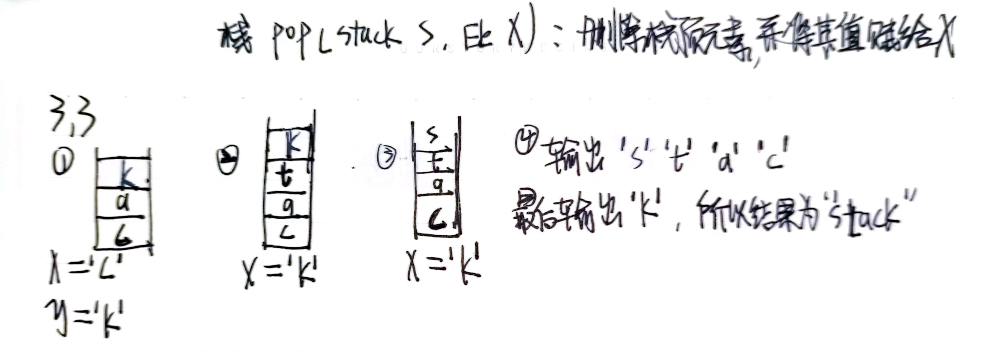
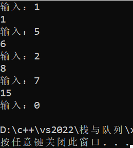
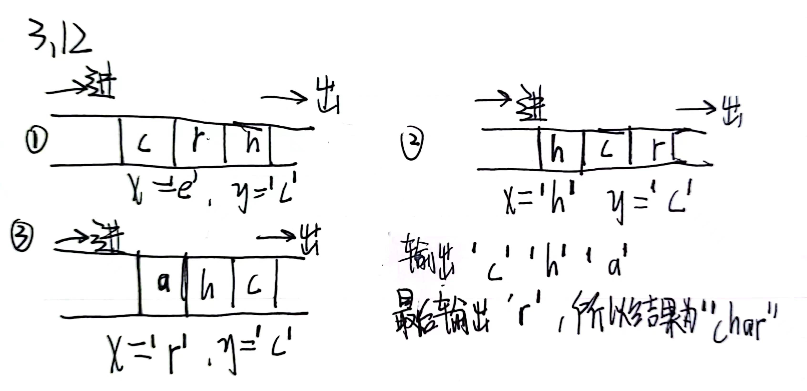
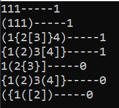
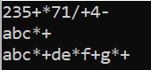
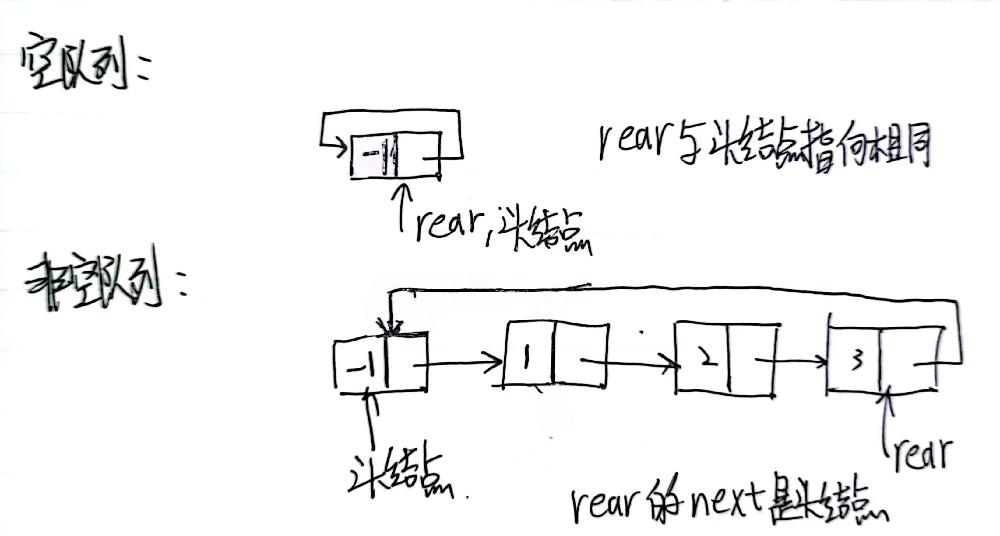
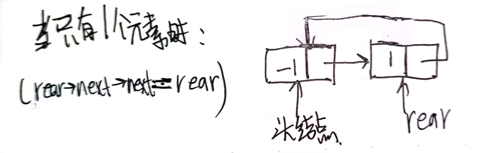
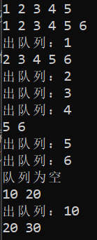

#### 3.3
{:width=200 height=200}
#### 3.7
| 步骤 | OPTR栈 | OPND栈 | 输入字符            | 主要操作         |
| ---- | ------ | ------ | ------------------- | ---------------- |
| 1    | #      |        | <u>A</u>-B*C/D+E^F# | push(OPND,A)     |
| 2    | #      | A      | <u>-</u>B*C/D+E^F#  | push(OPTR,-)     |
| 3    | #-     | A      | <u>B</u>*C/D+E^F#   | push(OPND,B)     |
| 4    | #-     | AB     | <u>*</u>C/D+E^F#    | push(OPTR,*)     |
| 5    | #-*    | AB     | <u>C</u>/D+E^F#     | push(OPND,C)     |
| 6    | #-*    | ABC    | ==/== D+E^F#        | G=operate(B,*,C) |
| 7    | #-     | AG     | <u>/</u>D+E^F#      | push(OPTR,/)     |
| 8    | #-/    | AG     | <u>D</u>+E^F#       | push(OPND,D)     |
| 9    | #-/    | AGD    | ==+== E^F#          | H=operate(G,/,D) |
| 10   | #-     | AH     | ==+== E^F#          | I=operate(A,-,H) |
| 11   | #      | I      | <u>+</u>E^F#        | push(OPTR,+)     |
| 12   | #+     | I      | <u>E</u>^F#         | push(OPND,E)     |
| 13   | #+     | IE     | <u>^</u>F#          | push(OPTR,^)     |
| 14   | #+^    | IE     | <u>F</u>#           | push(OPND,F)     |
| 15   | #+^    | IEF    | ==#==               | J=operate(E,^,F) |
| 16   | #+     | IJ     | ==#==               | K=operate(I,+,J) |
| 17   | #      | K      | ==#==               | return           |

注：输入栈中的字符用下划线标出，未标出的为每次的待输入字符
#### 3.10
```
void new_test(int& sum)
{
	int x;
	while (1)
	{
		cout << "输入：";
		cin >> x;
		if (x == 0) break; //当输入为0时停止循环
		sum += x;
		cout << sum << endl;
	}
}
```
测试：
```
int main()
{
	int sum = 0;
	new_test(sum);
	return 0;
}
```
测试结果：
{:width=200 height=200}
#### 3.12
{:width=250 height=250}
#### 3.19
```
//判断str中的括号()[]{}是否正确匹配，若正确匹配则返回true，否则返回false
bool brackets_match(const char* str)
{
	stack s = init_stack(); //创建一个空栈
	int data; //用于存储弹出栈的元素
	for (int i = 0; str[i] != '\0'; i++)
	{
		if (str[i] == '(' || str[i] == '[' || str[i] == '{')
		{
			push(s, str[i]);
		}
		else if (str[i] == ')' || str[i] == ']' || str[i] == '}')
		{
			pop(s, data);
			switch (str[i])
			{
			case ')':
				if (data != '(') return false;
				break;
			case ']':
				if (data != '[') return false;
				break;
			case '}':
				if (data != '{') return false;
				break;
			}
		}
		else;
	}
	return is_empty(s); //若栈空，则括号匹配，返回true；否则返回false
}
```
测试：
```
int main()
{
	const char* s1 = "111";
	printf("%s-----%d\n", s1, brackets_match(s1));
	const char* s2 = "(111)";
	printf("%s-----%d\n", s2, brackets_match(s2));
	const char* s3 = "(1{2[3]}4)";
	printf("%s-----%d\n", s3, brackets_match(s3));
	const char* s4 = "{1(2)3[4]}";
	printf("%s-----%d\n", s4, brackets_match(s4));
	const char* s5 = "1(2{3}]";
	printf("%s-----%d\n", s5, brackets_match(s5));
	const char* s6 = "{1(2)3(4]}";
	printf("%s-----%d\n", s6, brackets_match(s6));
	const char* s7 = "({1([2])";
	printf("%s-----%d\n", s7, brackets_match(s7));
	return 0;
}
```
测试结果：
{:width=200 height=200}
#### 3.21
逆波兰式即后缀表达式（运算符在它的操作数之后）
思路：
1. 创建一个空栈用于存储运算符，再创建一个结果数组用于存储输出的逆波兰式
2. 从前向后遍历正常表达式
   - 如果遇到数字（单字母变量），就把它添加到结果数组中
   - 如果遇到运算符，就压入栈中；此时需要先从栈中弹出所有优先级更高或相等的运算符，并添加到结果数组中
   - 如果遇到左括号，就将其压入栈中
   - 如果遇到右括号，就从栈中弹出运算符并添加到结果数组中，直到遇到左括号为止，并将左括号出栈
3. 如果表达式已遍历完毕，但栈中仍有运算符，就将它们全部添加到结果数组中

为简便添加到结果数组中的操作，使用`<string>`作为结果数组
```
#include<string>
using std::string;
string s; char c;
s += c; //表示把c添加到s字符串末尾
```
实现代码：
```
//定义各符号的优先级
int _define_priority(char c)
{
	switch (c)
	{
	case '+':
	case '-':
		return 1; //+-的优先级为1
	case '*':
	case '/':
		return 2; //*/的优先级为2
	default:
		return 0;
	}
}
//判断c是不是字母/数字
bool is_var(char c)
{
	return isalpha(c) || isdigit(c);
}
//正常表达式转后缀表达式
string infix_to_postfix(const char* str)
{
	stack optr = init_stack(); //用于储存运算符的栈
	string res;
	for (int i = 0; str[i] != '\0'; i++)
	{
		if (is_var(str[i])) //如果是单字母变量/数字
			res += str[i]; //就把它添加到结果数组中
		else if (str[i] == '(') //如果遇到左括号
			push(optr, str[i]); //就将其压入栈中
		else if (str[i] == ')') //如果遇到右括号
		{
			while (!is_empty(optr) && char(get_top(optr)) != '(') 
			{ //直到遇到左括号/栈空为止
				res += char(get_top(optr));
				pop(optr);  //从栈中弹出运算符并添加到结果数组中
			}
			if (char(get_top(optr)) == '(') pop(optr); //并将左括号出栈
		}
		else //如果遇到运算符
		{
			while (!is_empty(optr) &&
				_define_priority(get_top(optr)) >= _define_priority(str[i])) 
			{ //先从栈中弹出所有优先级更高或相等的运算符
				res += char(get_top(optr)); //并添加到结果数组中
				pop(optr); 
			}
			push(optr, str[i]); //再压入栈中
		}
	}
	while (!is_empty(optr)) //如果表达式已遍历完毕，但栈中仍有运算符
	{
		res += char(get_top(optr)); //就将它们全部添加到结果数组中
		pop(optr);
	}
	return res;
}
```
测试代码：
```
int main()
{
	const char* exp1 = "2*(3+5)+7/1-4";
	const char* exp2 = "a+b*c";
	const char* exp3 = "a+b*c+(d*e+f)*g";
	cout << infix_to_postfix(exp1) << endl;
	cout << infix_to_postfix(exp2) << endl;
	cout << infix_to_postfix(exp3) << endl;
	return 0;
}
```
运行结果：
{:width=100 height=100}
#### 3.28
带头节点的循环链表：最后一个元素的next指向头结点
{:width=200 height=200}
结构体定义如下：
```
struct queue_node //队列中的节点
{
	int data; //数据
	struct queue_node* next; //next指针
};
struct my_queue //队列
{
	struct queue_node* rear; 
	//只设一个指针指向队尾元素节点
};
```
基本结构：
{:width=200 height=200}
初始化队列：就是创建一个空的循环链表（头节点的next指向它自己），并让这个头节点成为队列的队尾节点
```
//初始化队列
my_queue* init_queue()
{
	my_queue* new_queue = new my_queue; //创建一个新队列
	new_queue->rear = new queue_node; //创建队列的尾节点（循环链表中的头节点）
	new_queue->rear->data = -1; //将尾节点的data置为-1
	new_queue->rear->next = new_queue->rear; //头节点的next指向它自己
	return new_queue;
}
```
入队列：在尾节点处插入元素，操作类似于链表的插入节点
```
//将值为val的节点加入队列
my_queue* add_queue(my_queue* q, int val)
{
	queue_node* new_node = new queue_node; //创建新节点
	new_node->data = val; //新节点的值为val
	new_node->next = q->rear->next; //新节点的next指向原尾节点的next（队列中的第一个元素）
	q->rear->next = new_node; //将新节点放在原尾节点后
	q->rear = new_node; //更新尾节点指针指向
	return q;
}
```
出队列：首先要判断队列是否为空（当尾节点的next指向它自己时，循环链表空，就是队列空），再删除头节点之后的节点，此时有2种情况：
- 队列中只有1个节点
   {:width=100 height=100}
   删除节点后，要将队尾指针指向头节点，恢复成空队列的样子
- 正常情况下，就是把头节点的next置为要删除节点的next

```
//出队列，返回出去元素的值
int del_queue(my_queue* q)
{
	if (is_empty_queue(q))
	{
		printf("队列为空\n");
		return -1;
	}
	queue_node* head = q->rear->next; //循环链表头节点--rear的next
	queue_node* del = head->next; //要删除的是头节点的下一个节点
	int del_data = del->data; //保存要删除节点的data
	if (del == q->rear) ///如果只有1个元素
	{
		head->next = head; //空循环链表
		q->rear = head; //更新尾指针
	}
	else //正常情况下
	{
		head->next = del->next; //头节点的next置为要删除节点的next
	}
	free(del); //释放要删除的节点
	return del_data;
}
```
测试代码：
```
//使用长度为n的a数组初始化队列
my_queue* init_queue_byArray(int a[],int n)
{
	my_queue* new_queue = init_queue();
	for (int i = 0; i < n; i++)
		add_queue(new_queue, a[i]);
	return new_queue;
}
int main()
{
	int a[5] = { 1,2,3,4,5 };
	my_queue* q = init_queue_byArray(a, 5);
	foreach_queue(q);
	add_queue(q, 6);
	foreach_queue(q);
	printf("出队列：%d\n", del_queue(q));
	foreach_queue(q);
	printf("出队列：%d\n", del_queue(q));
	printf("出队列：%d\n", del_queue(q));
	printf("出队列：%d\n", del_queue(q));
	foreach_queue(q);
	printf("出队列：%d\n", del_queue(q));
	printf("出队列：%d\n", del_queue(q));
	del_queue(q);
	add_queue(q, 10);
	add_queue(q, 20);
	foreach_queue(q);
	printf("出队列：%d\n", del_queue(q));
	add_queue(q, 30);
	foreach_queue(q);
	return 0;
}
```
运行结果：
{:width=300 height=300}